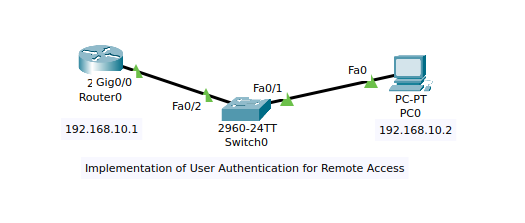
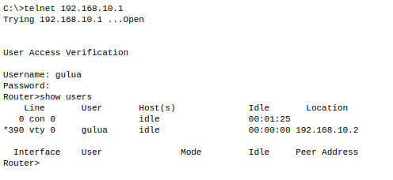
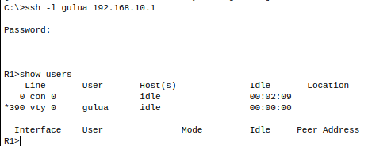

# 🔐 Computer Networking: Security (CSE 3752)  
## 🧪 Experiment 1  
# Implementation of User Authentication for Remote Access using Cisco Packet Tracer

---

## 🎯 Aim

To implement user authentication technique for remote access of a network device in computer network using Cisco Packet Tracer.

---

## 📌 Objectives

1. To understand user authentication technique used in secured systems.  
2. To configure and verify remote user authentication using Telnet.  
3. To configure and verify remote user authentication using SSH.  

---

# 🖥️ Topology

- Router (2901)
- Switch (2960-24TT)
- PC (PC-PT)

IP Addressing:

- Router (Gig0/0): 192.168.10.1 /24  
- PC: 192.168.10.2 /24  

---

## 📷 Screenshot 1: Network Topology  
*(Save image as: `assets/topology.png`)*

```

```

---

# 🔹 PART 1 – TELNET CONFIGURATION

## Step 1: Enter Configuration Mode

```
Router>enable
Router#
Router#configure terminal
Enter configuration commands, one per line.  End with CNTL/Z.
Router(config)#
```

---

## Step 2: Create Local User Account

```
Router(config)#username ?
  WORD  User name

Router(config)#username gulua privilege 15 password 0 cisco123
Router(config)#
```

📌 Class Note:  
- `privilege 15` = Full admin access  
- `password 0` = Plain text password  

---

## Step 3: Configure VTY Lines

```
Router(config)#line ?
  aux
  console
  vty

Router(config)#line vty 0 4
Router(config-line)#login local
Router(config-line)#transport input ?
  ssh
  telnet

Router(config-line)#transport input telnet
Router(config-line)#exit
Router(config)#
```

---

## Step 4: Encrypt Passwords

```
Router(config)#service ?
  password-encryption

Router(config)#service password-encryption
Router(config)#enable secret class
Router(config)#exit
Router#
```

---

## Step 5: Verify Telnet Login

From PC:

```
C:\>telnet 192.168.10.1
Username: gulua
Password:
```

Check users:

```
Router>show users
```

---

## 📷 Screenshot 2: Telnet Login Verification  
*(Save image as: `assets/telnet-login.png`)*

```

```

---

# 🔹 PART 2 – SSH CONFIGURATION

## Step 6: Configure Hostname and Domain Name

```
Router#config
Router(config)#hostname R1
R1(config)#ip domain-name swayam.io
```

---

## Step 7: Generate RSA Keys

```
R1(config)#crypto key generate rsa
How many bits in the modulus [512]: 1024
% Generating 1024 bit RSA keys, keys will be non-exportable...[OK]
```

---

## 📷 Screenshot 3: RSA Key Generation  
*(Save image as: `assets/rsa-generation.png`)*

```

```

---

## Step 8: Enable SSH and Disable Telnet

```
R1(config)#ip ssh version 2
R1(config)#line vty 0 4
R1(config-line)#transport input ssh
R1(config-line)#login local
R1(config-line)#exit
R1(config)#
```

---

## 📷 Screenshot 4: SSH Configuration on VTY  
*(Save image as: `assets/ssh-config.png`)*

```

```

---

## Step 9: Verify SSH Login

From PC:

```
C:\>ssh -l gulua 192.168.10.1
Password:
```

Check users:

```
R1>show users
```

---

## 📷 Screenshot 5: SSH Login Verification  
*(Save image as: `assets/ssh-login.png`)*

```

```

---

# 📊 Telnet vs SSH

| Feature | Telnet | SSH |
|----------|--------|------|
| Security | Not Secure | Secure |
| Encryption | No | Yes |
| Port | 23 | 22 |

---

# 📘 Exercises

## 1. State the importance of user authentication in a secured system.

User authentication verifies user identity and prevents unauthorized access to network devices.

---

## 2. Commands:

### a) Create user CNSLab with password cisco

```
Router(config)#username CNSLab password 0 cisco
```

### b) Set privilege level 15

```
Router(config)#username CNSLab privilege 15 password 0 cisco
```

### c) Create encrypted password

```
Router(config)#enable secret cisco
Router(config)#service password-encryption
```

---

## 3. Features of SSH

- Secure remote login  
- Encrypted communication  
- Uses RSA cryptography  
- Port 22  

---

## 4. Compare SSH and Telnet

SSH is secure and encrypted.  
Telnet is insecure and sends data in plain text.

---

# ✅ Result

Successfully configured and verified Telnet and SSH authentication on Cisco Router.

