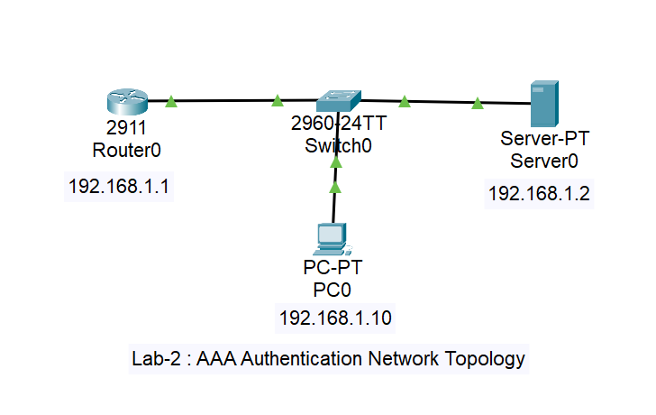

# 🔐 AAA Server Lab — Cisco Packet Tracer
### CSE3752 | Computer Networking: Security | Experiment 2

> **Implementation of an AAA server as a user authentication and authorization technique for remote access to a network device using Cisco Packet Tracer.**

---

## 📋 Table of Contents

1. [Objectives](#objectives)
2. [Objective 1 — AAA Theory Overview](#objective-1--aaa-theory-overview)
3. [Topology & IP Plan](#topology--ip-plan)
4. [Objective 2 — AAA with Telnet Authentication](#objective-2--aaa-with-telnet-authentication)
   - [Step 1 — Build Topology in Packet Tracer](#step-1--build-topology-in-packet-tracer)
   - [Step 2 — Configure PC0 IP](#step-2--configure-pc0-ip)
   - [Step 3 — Configure Server0 (AAA Server)](#step-3--configure-server0-aaa-server)
   - [Step 4 — Configure Router (CLI)](#step-4--configure-router-cli--telnet)
   - [Step 5 — Verify Telnet Authentication](#step-5--verify-telnet-authentication)
5. [Objective 3 — AAA with SSH Authentication](#objective-3--aaa-with-ssh-authentication)
   - [Step 1-3 — Reuse Topology, PC & Server Config](#step-1-3--reuse-topology-pc--server-config)
   - [Step 4 — Configure Router (CLI)](#step-4--configure-router-cli--ssh)
   - [Step 5 — Verify SSH Authentication](#step-5--verify-ssh-authentication)
6. [Verification Summary Table](#verification-summary-table)
7. [Quick Reference — All CLI Commands](#quick-reference--all-cli-commands)

---

## Objectives

| # | Objective |
|---|-----------|
| 1 | Overview of AAA (Authentication, Authorization, Accounting) |
| 2 | Configure & verify remote user authentication using AAA + **Telnet** |
| 3 | Configure & verify remote user authentication using AAA + **SSH** |

---

## Objective 1 — AAA Theory Overview

AAA is a **security framework** that controls three things on a network device:

---

### 🔑 Authentication — "Who are you?"
Verifies the identity of the user trying to access the device.

```
User ──→ Router ──→ RADIUS Server ──→ "Valid? Yes / No"
```

- The router forwards the username & password to the RADIUS server.
- Server checks its user database and replies with **Accept** or **Reject**.

---

### 🛡️ Authorization — "What can you do?"
After login, decides what level of access the user gets.

```
privilege 1   →  Basic user  (show commands only)
privilege 15  →  Full admin  (all commands, global config)
```

---

### 📊 Accounting — "What did you do?"
Tracks and logs everything the user did during the session — useful for audits and security reviews.

```
Log: "admin logged in at 10:35, ran 'shutdown' on int g0/0, logged out at 10:40"
```

---

### AAA vs Local Authentication

| Feature | Local Auth | AAA (RADIUS) |
|---------|-----------|--------------|
| Users stored | On router itself | On central server |
| Scalability | ❌ Poor | ✅ Excellent |
| Security | ❌ Weak (plain text) | ✅ Strong (encrypted) |
| Audit Logs | ❌ None | ✅ Full accounting |
| Fallback option | — | ✅ Local DB as backup |

---

### AAA Architecture in this Lab

```
┌─────────┐   Telnet / SSH    ┌──────────────┐
│   PC0   │ ────────────────▶ │   Router0    │
│.1.10    │                   │   .1.1       │
└─────────┘                   └──────┬───────┘
                                     │  RADIUS Protocol
                                     │  "Is this user valid?"
                               ┌─────▼──────┐
                               │  Server0   │
                               │ (AAA/RADIUS│
                               │  Server)   │
                               │   .1.2     │
                               └────────────┘
```

---

## Topology & IP Plan

### Network Diagram


### IP Address Table

| Device | Interface | IP Address | Subnet Mask | Default Gateway |
|--------|-----------|------------|-------------|-----------------|
| Router0 | Gig0/0 | 192.168.1.1 | 255.255.255.0 | — |
| Server0 | Fa0 | 192.168.1.2 | 255.255.255.0 | 192.168.1.1 |
| PC0 | Fa0 | 192.168.1.10 | 255.255.255.0 | 192.168.1.1 |

### Cable Connections

| From | Port | To | Port | Cable Type |
|------|------|----|------|-----------|
| Router0 | Gig0/0 | Switch0 | Fa0/1 | Copper Straight-Through |
| PC0 | Fa0 | Switch0 | Fa0/2 | Copper Straight-Through |
| Server0 | Fa0 | Switch0 | Fa0/3 | Copper Straight-Through |

---

---

# Objective 2 — AAA with Telnet Authentication

> Telnet is a **basic remote access protocol** (unencrypted). We use it here to first understand AAA authentication before adding SSH encryption.

---

## Step 1 — Build Topology in Packet Tracer

1. Open **Cisco Packet Tracer**
2. From the bottom panel, drag and place these devices:

| Device Type | Model to Select |
|-------------|----------------|
| Router | **2901** |
| Switch | **2960-24TT** |
| End Device | **PC-PT** |
| End Device | **Server-PT** |

3. Select **Copper Straight-Through** cable and connect:
   - `Router0 Gig0/0` → `Switch0 Fa0/1`
   - `PC0 Fa0` → `Switch0 Fa0/2`
   - `Server0 Fa0` → `Switch0 Fa0/3`

4. All green triangle indicators should appear on switch ports once IPs are configured.

---

## Step 2 — Configure PC0 IP

1. Click on **PC0**
2. Go to **Desktop** tab → Click **IP Configuration**
3. Select **Static** and enter:

```
IP Address     : 192.168.1.10
Subnet Mask    : 255.255.255.0
Default Gateway: 192.168.1.1
DNS Server     : (leave blank)
```

4. Close the window.

---

## Step 3 — Configure Server0 (AAA Server)

### 3A — Set Server IP Address

1. Click on **Server0**
2. Go to **Desktop** tab → **IP Configuration**
3. Enter:

```
IP Address     : 192.168.1.2
Subnet Mask    : 255.255.255.0
Default Gateway: 192.168.1.1
```

---

### 3B — Enable AAA Service on Server

1. Click on **Server0**
2. Go to **Services** tab → Click **AAA** in the left panel
3. Toggle **Service: ON**

---

### 3C — Add Router as a Trusted Client

In the **Network Configuration** section, fill in:

```
Client Name  : Router0
Client IP    : 192.168.1.1
Secret       : cisco
ServerType   : Radius
```

> ⚠️ The **Secret key** (`cisco`) must be exactly the same on both the Server and the Router CLI. If they don't match, authentication will fail.

→ Click **Add** button

---

### 3D — Add Remote User

In the **User Setup** section, fill in:

```
Username : admin
Password : admin123
```

→ Click **Add** button

> This is the user who will remotely log in to the router via Telnet.

---

## Step 4 — Configure Router CLI (Telnet)

Click on **Router0** → Go to **CLI** tab

---

### 4A — Enter Privileged & Config Mode

```bash
Router> enable
Router# configure terminal
```

---

### 4B — Configure Router Interface IP

```bash
Router(config)# interface gigabitEthernet 0/0
Router(config-if)# ip address 192.168.1.1 255.255.255.0
Router(config-if)# no shutdown
Router(config-if)# exit
```

> `no shutdown` turns the interface ON. Cisco router interfaces are shutdown by default.

---

### 4C — Enable AAA (Most Important Command)

```bash
Router(config)# aaa new-model
```

> Without this command, **no AAA feature will work**. This switches the router from simple login mode to centralized AAA control.

---

### 4D — Point Router to RADIUS Server

```bash
Router(config)# radius-server host 192.168.1.2 key cisco
```

> Tells the router where the AAA server is (`192.168.1.2`) and sets the shared secret key `cisco`. This key must match what was set on the server in Step 3C.

---

### 4E — Set Authentication Method List

```bash
Router(config)# aaa authentication login default group radius local
```

> Sets the rule for every login attempt:
> 1. **First** check RADIUS server (`group radius`)
> 2. **If server is unreachable**, fall back to local database (`local`)

---

### 4F — Create Local Backup User

```bash
Router(config)# username backup privilege 15 secret backup123
```

> This is a fallback emergency user stored on the router itself.
> Used when the AAA server is down or unreachable.
> `privilege 15` = full admin access.

---

### 4G — Set Enable Password

```bash
Router(config)# enable secret cisco123
```

> Required so that after Telnet login, users need a password to enter privileged `enable` mode.

---

### 4H — Configure VTY Lines for Telnet

```bash
Router(config)# line vty 0 4
Router(config-line)# transport input telnet
Router(config-line)# login authentication default
Router(config-line)# exit
```

> `line vty 0 4` — opens 5 virtual remote access channels (0 through 4)
> `transport input telnet` — only allow Telnet connections
> `login authentication default` — use the AAA method list we created

---

### 4I — Save Configuration

```bash
Router(config)# end
Router# write memory
```

---

## Step 5 — Verify Telnet Authentication

Open **PC0** → **Desktop** → **Command Prompt**

---

### ✅ Test 1 — Normal Login (Server is connected)

```bash
telnet 192.168.1.1
```

```
Trying 192.168.1.1 ...Open

User Access Verification
Username: admin
Password: admin123
```

**Expected result:** Login successful ✅
Router contacted RADIUS server → server confirmed `admin` is valid → access granted.

---

### ✅ Test 2 — Fallback Test (Remove Server cable)

1. In Packet Tracer, **click on the cable between Server0 and Switch0** → press **Delete**
2. Wait a few seconds for the connection to drop
3. On PC0 Command Prompt:

```bash
telnet 192.168.1.1
```

```
Username: backup
Password: backup123
```

**Expected result:** Login successful ✅
RADIUS server is unreachable → router used local database → `backup` user found → access granted.

---

### ❌ Test 3 — admin login with Server down (Should FAIL)

```bash
telnet 192.168.1.1
```

```
Username: admin
Password: admin123
```

**Expected result:** Login FAILED ❌
`admin` only exists on the RADIUS server (not in local DB) → server is down → no record found → **Access Denied**

---

---

# Objective 3 — AAA with SSH Authentication

> **SSH (Secure Shell)** is an encrypted version of remote access. Unlike Telnet which sends data as plain text, SSH encrypts all traffic. Extra steps needed: domain name, RSA keys, SSH version.

---

## Step 1-3 — Reuse Topology, PC & Server Config

> **The topology, PC0 IP, and Server0 AAA configuration remain exactly the same as Objective 2.**

- Same devices, same cables, same connections
- Same PC0 IP: `192.168.1.10`
- Same Server0 IP: `192.168.1.2`
- Same AAA service ON with client `Router0` / key `cisco`
- Same user `admin / admin123` on the server

---

## Step 4 — Configure Router CLI (SSH)

Click on **Router0** → Go to **CLI** tab

---

### 4A to 4F — Same as Objective 2

Run the same commands as Objective 2 Steps 4A through 4F:

```bash
Router> enable
Router# configure terminal

# Interface IP
Router(config)# interface gigabitEthernet 0/0
Router(config-if)# ip address 192.168.1.1 255.255.255.0
Router(config-if)# no shutdown
Router(config-if)# exit

# AAA
Router(config)# aaa new-model
Router(config)# radius-server host 192.168.1.2 key cisco
Router(config)# aaa authentication login default group radius local

# Local backup user
Router(config)# username backup privilege 15 secret backup123
```

---

### 4G — Set Hostname (Required for SSH)

```bash
Router(config)# hostname R1
```

> SSH needs a fully qualified domain name to generate RSA keys. Hostname is the first part of that name.

---

### 4H — Set Domain Name (Required for SSH)

```bash
R1(config)# ip domain-name cnslab2.com
```

> Combined with hostname, this creates `R1.cnslab2.com` — required for RSA key generation.

---

### 4I — Generate RSA Keys

```bash
R1(config)# crypto key generate rsa
```

When prompted:

```
How many bits in the modulus [512]: 1024
```

> Type `1024` and press Enter.
> 1024-bit RSA key pair is generated (public + private).
> This is the encryption key that makes SSH secure.
> 512-bit is too weak; 1024 is the standard minimum.

---

### 4J — Enable SSH Version 2

```bash
R1(config)# ip ssh version 2
```

> SSH version 2 is more secure than version 1.
> Version 1 has known vulnerabilities and should not be used.

---

### 4K — Configure VTY Lines for SSH Only

```bash
R1(config)# line vty 0 4
R1(config-line)# transport input ssh
R1(config-line)# login authentication default
R1(config-line)# exit
```

> Only difference from Objective 2:
> `transport input ssh` instead of `transport input telnet`
> This completely **blocks Telnet** and allows **only SSH** for remote access.

---

### 4L — Save Configuration

```bash
R1(config)# end
R1# write memory
```

---

## Step 5 — Verify SSH Authentication

Open **PC0** → **Desktop** → **Command Prompt**

---

### ✅ Test 1 — Normal SSH Login (Server connected)

```bash
ssh -l admin 192.168.1.1
```

```
Password: admin123
```

**Expected result:** Login successful ✅
`-l admin` means "login as admin". Router checked RADIUS server → valid → SSH session opened.

---

### ❌ Test 2 — Try Telnet (Should be BLOCKED)

```bash
telnet 192.168.1.1
```

**Expected result:** Connection refused / timeout ❌
We set `transport input ssh` so Telnet is completely blocked. This is the security benefit of SSH config.

---

### ✅ Test 3 — Fallback Test (Remove Server cable)

1. **Delete the cable** between Server0 and Switch0
2. On PC0:

```bash
ssh -l backup 192.168.1.1
```

```
Password: backup123
```

**Expected result:** Login successful ✅
Server unreachable → local fallback → `backup` user found in local DB → access granted.

---

### ❌ Test 4 — admin login with server down

```bash
ssh -l admin 192.168.1.1
```

```
Password: admin123
```

**Expected result:** Login FAILED ❌
`admin` not in local DB → server down → Access Denied.

---

