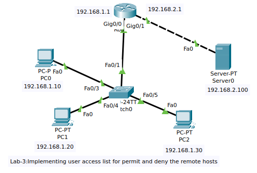

# Experiment 3: Implementing User Access List (ACL) for Permit and Deny Remote Hosts

## Aim
Implement Standard and Extended Access Control Lists (ACLs) on a router to control which remote hosts can access a server — simulating a LAN where multiple hosts attempt to access a server through a router.

---

## Objectives
1. Overview of Standard and Extended Access Control Lists (ACLs).
2. Configuration and verification of a **Standard ACL** to permit/deny access to a remote server.
3. Configuration and verification of an **Extended ACL** to permit/deny access to a remote server via **HTTP/FTP**.

---

## Network Topology



---

## Step 1: Create the Topology

Set up the following devices in Cisco Packet Tracer (or equivalent):

| Device     | Interface  | Role              |
|------------|------------|-------------------|
| Router     | Gig0/0     | LAN side (PCs)    |
| Router     | Gig0/1     | Server side       |
| Switch     | Fa0/1–Fa0/5| Connects PCs      |
| PC0        | Fa0        | Host              |
| PC1        | Fa0        | Host              |
| PC2        | Fa0        | Host              |
| Server0    | Fa0        | Web/FTP Server    |

---

## Step 2: Assign IP Addresses

### Router Interfaces

```bash
Router> enable
Router# configure terminal

Router(config)# interface GigabitEthernet0/0
Router(config-if)# ip address 192.168.1.1 255.255.255.0
Router(config-if)# no shutdown
Router(config-if)# exit

Router(config)# interface GigabitEthernet0/1
Router(config-if)# ip address 192.168.2.1 255.255.255.0
Router(config-if)# no shutdown
Router(config-if)# exit
```

### End Device IP Configuration

| Device  | IP Address      | Subnet Mask     | Default Gateway |
|---------|-----------------|-----------------|-----------------|
| PC0     | 192.168.1.10    | 255.255.255.0   | 192.168.1.1     |
| PC1     | 192.168.1.20    | 255.255.255.0   | 192.168.1.1     |
| PC2     | 192.168.1.30    | 255.255.255.0   | 192.168.1.1     |
| Server0 | 192.168.2.100   | 255.255.255.0   | 192.168.2.1     |

---

## Step 3: Configure the Router

Ensure both interfaces are up and the router can route between the two subnets (done in Step 2 above).

---

## Step 4: Check Connectivity

From **PC0**, ping the server to verify basic connectivity:

```bash
C:\> ping 192.168.2.100
```

**Expected Output:**
```
Pinging 192.168.2.100 with 32 bytes of data:
Reply from 192.168.2.100: bytes=32 time<1ms TTL=127
Reply from 192.168.2.100: bytes=32 time<1ms TTL=127
...
Ping statistics: Packets: Sent = 4, Received = 4, Lost = 0 (0% loss)
```

---

## Part A: Standard ACL

### Overview
A **Standard ACL** filters traffic based only on the **source IP address**.
- ACL numbers **1–99** are used for standard ACLs.
- Standard ACLs should be applied **closest to the destination**.

---

### Step 5: Create the Standard ACL

**Goal:** Block **PC1 (192.168.1.20)** from accessing the server; allow all other hosts.

```bash
Router> enable
Router# configure terminal

! Deny PC1 (192.168.1.20) - wildcard 0.0.0.0 means exact host match
Router(config)# access-list 10 deny 192.168.1.20 0.0.0.0

! Permit all other traffic (implicit deny-all would block everyone else otherwise)
Router(config)# access-list 10 permit any
```

> **Note on Wildcard Mask:**
> - `0.0.0.0` → Check **all** bits of the IP address (exact host match).
> - Equivalent to using the `host` keyword: `access-list 10 deny host 192.168.1.20`

---

### Step 6: Apply the Standard ACL to the Router Interface

Apply the ACL **inbound** on `Gig0/0` (the client-facing interface — traffic entering from PCs):

```bash
Router(config)# interface GigabitEthernet0/0
Router(config-if)# ip access-group 10 in
Router(config-if)# exit
```

---

### Step 7: Test the Standard ACL

#### From PC0 (192.168.1.10) — Should SUCCEED:
```bash
C:\> ping 192.168.2.100
```
✅ **Expected:** Ping replies received (permitted by `permit any`).

#### From PC1 (192.168.1.20) — Should FAIL:
```bash
C:\> ping 192.168.2.100
```
❌ **Expected:** `Destination host unreachable` (blocked by `deny 192.168.1.20`).

---

## Part B: Extended ACL

### Overview
An **Extended ACL** filters traffic based on:
- **Source IP address**
- **Destination IP address**
- **Protocol** (TCP, UDP, ICMP, IP)
- **Port numbers** (e.g., HTTP = 80, FTP = 21)

- ACL numbers **100–199** are used for extended ACLs.
- Extended ACLs should be applied **closest to the source**.

---

### Step 8: Create the Extended ACL

**Goals:**
- Allow **PC0 (192.168.1.10)** to access the server via **HTTP (port 80)**.
- Block **PC1 (192.168.1.20)** from accessing the server via **FTP (port 21)**.
- Permit all other IP traffic.

```bash
Router> enable
Router# configure terminal

! Allow PC0 to access Server via HTTP (TCP port 80)
Router(config)# access-list 100 permit tcp host 192.168.1.10 host 192.168.2.100 eq 80

! Deny PC1 from accessing Server via FTP (TCP port 21)
Router(config)# access-list 100 deny tcp host 192.168.1.20 host 192.168.2.100 eq 21

! Permit all other IP traffic (without this, implicit deny blocks everything else)
Router(config)# access-list 100 permit ip any any
```

> **Port Reference:**
> | Service | Protocol | Port |
> |---------|----------|------|
> | HTTP    | TCP      | 80   |
> | FTP     | TCP      | 21   |
> | HTTPS   | TCP      | 443  |

---

### Step 9: Apply the Extended ACL to the Router Interface

First, **remove the old Standard ACL (10)**, then apply the new Extended ACL (100) inbound on `Gig0/0`:

```bash
Router(config)# interface GigabitEthernet0/0

! Remove the previously applied standard ACL
Router(config-if)# no ip access-group 10 in

! Apply the extended ACL inbound
Router(config-if)# ip access-group 100 in
Router(config-if)# exit
```

---

### Step 10: Configure Server Services

On **Server0**, enable the following services via the Packet Tracer GUI:

1. Navigate to **Server0 → Services tab**.
2. Enable **HTTP** service → click **On**.
3. Enable **FTP** service → click **On**.

---

### Step 11: Test the Extended ACL

#### From PC0 — HTTP Access (Should SUCCEED):
Open a web browser on PC0 and navigate to:
```
http://192.168.2.100
```
✅ **Expected:** Cisco Packet Tracer web page loads successfully (HTTP port 80 is permitted for PC0).

#### From PC1 — FTP Access (Should FAIL):
Open the command prompt on PC1 and try:
```bash
C:\> ftp 192.168.2.100
```
❌ **Expected Output:**
```
Trying to connect...192.168.2.100
%Error opening ftp://192.168.2.100/ (Timed out)
```
(FTP port 21 is denied for PC1.)

---


## Verification Commands

```bash
! View all configured ACLs
Router# show access-lists

! View ACLs applied on an interface
Router# show ip interface GigabitEthernet0/0

! View running configuration
Router# show running-config
```

---

