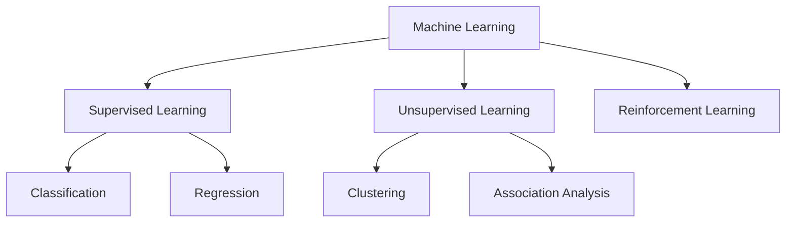
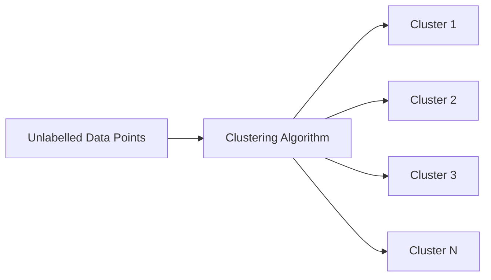
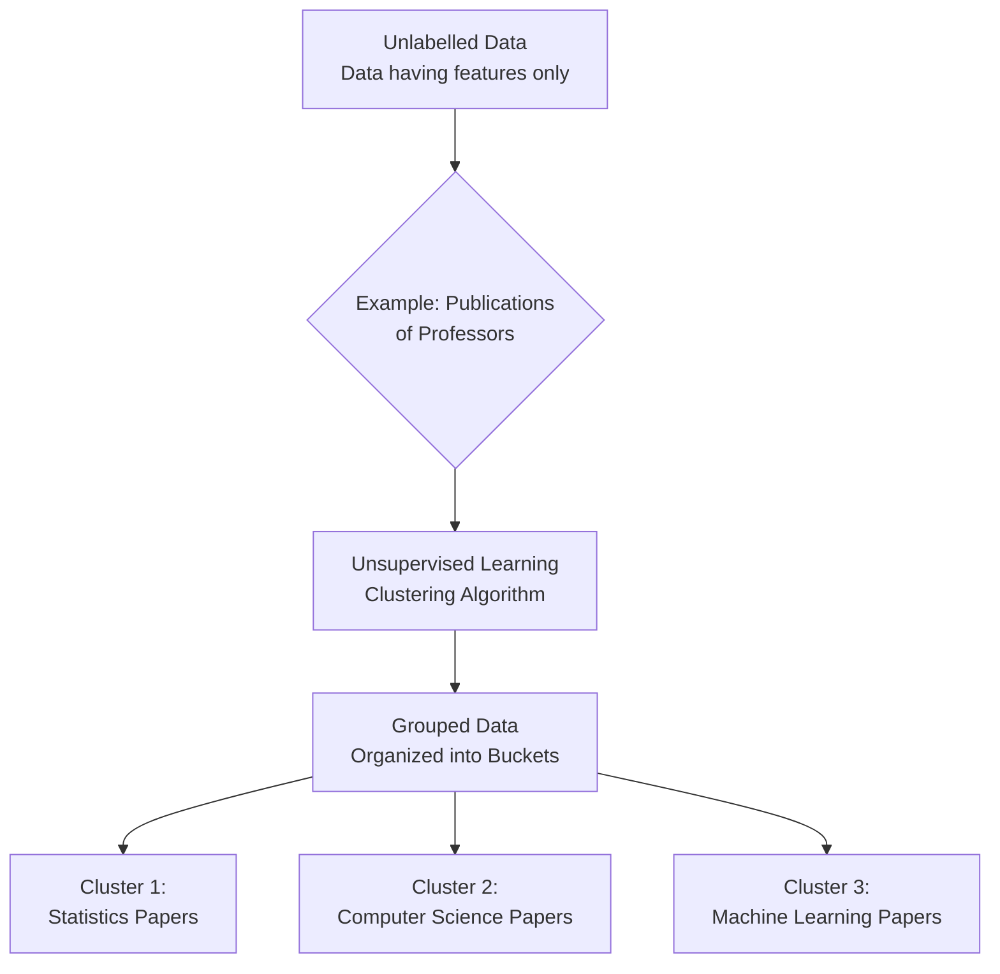
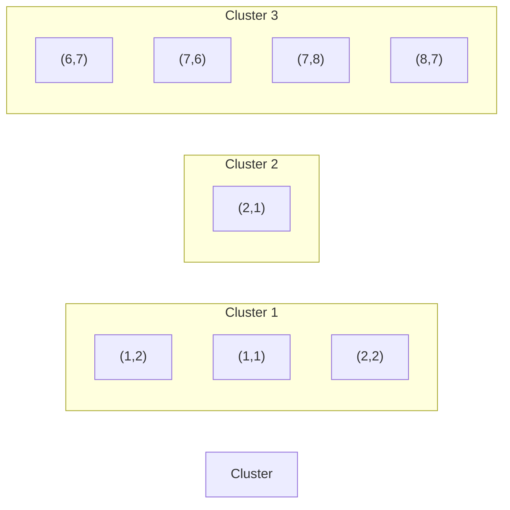

# CH-9: Unsupervised Learning

**Unsupervised Learning** is a type of machine learning used to find **hidden structures or patterns** in a given **unlabelled dataset** without any predefined labels or target outcomes.

---

## Machine Learning Classification



---

## Supervised vs Unsupervised Learning

| Aspect       | Supervised Learning            | Unsupervised Learning          |
|-------------|--------------------------------|--------------------------------|
| **Data Type**   | Labelled data                  | Unlabelled data                |
| **Objective**  | Predict outcomes               | Discover hidden structure      |
| **Output**     | Class labels / values          | Groups / association rules     |
| **Examples**   | Classification, Regression     | Clustering, Association        |

---

## Applications of Unsupervised Learning

- **Customer and Market Segmentation**: Grouping customers based on purchasing behavior and demographics for targeted marketing
- **Fraud and Anomaly Detection**: Identifying unusual patterns in transactions or system behavior that deviate from normal
- **Image Processing and Face Recognition**: Detecting and grouping similar facial features without pre-labeled training data
- **Gene Analysis and Bioinformatics**: Discovering patterns in genetic data to identify gene families or disease markers
- **Dimensionality Reduction**: Reducing the number of features while preserving important information for easier visualization
- **Document Clustering**: Organizing large collections of documents into meaningful topic-based groups
- **Artificial Intelligence Systems**: Enabling AI to learn and adapt from data without explicit programming or supervision

---

## Clustering

### Definition
Clustering is the process of grouping objects such that:
- Objects within a cluster are **highly similar** to each other
- Objects from different clusters are **highly dissimilar** from each other

### Key Characteristics

1. **Unsupervised Learning**: Works with data that has no predefined labels or categories
2. **No Predefined Class Labels**: Algorithm discovers natural groupings without prior knowledge of categories
3. **Reduces Data Complexity**: Simplifies large datasets by organizing them into meaningful groups
4. **Helps Discover Hidden Patterns**: Reveals underlying structures and relationships not immediately apparent
5. **Flexible with Different Types of Data**: Can handle numerical, categorical, text, and mixed data types
6. **Scalable to Large Datasets**: Efficient algorithms enable processing of massive amounts of data

---

### Clustering Visualization



---

### Applications of Clustering

- **Market Research**: Identifying customer segments with similar characteristics
- **Social Network Analysis**: Detecting communities and groups in social networks
- **Recommendation Systems**: Grouping users or products with similar preferences
- **Medical Diagnosis**: Identifying patient groups with similar symptoms or disease patterns
- **Astronomy**: Classifying celestial objects based on their properties
- **City Planning**: Identifying zones based on land use patterns
- **Search Engines**: Organizing search results into topic clusters

---

## Flow Diagram of Clustering Analysis



---

## K-Means Clustering: Complete Example

### Dataset
Points: `(1,2)`, `(2,1)`, `(1,1)`, `(2,2)`, `(6,7)`, `(7,6)`, `(7,8)`, `(8,7)`

---

### Step 1: Initialize Centroids

Randomly select 3 initial centroids:
- **C1** = `(1, 2)`
- **C2** = `(2, 1)`
- **C3** = `(7, 8)`

---

### Step 2: Distance Calculation (Iteration 1)

**Euclidean Distance Formula:**
```
d((x,y), (a,b)) = √[(x-a)² + (y-b)²]
```

| Point | Coordinates | d to C1(1,2) | d to C2(2,1) | d to C3(7,8) | Assigned Cluster |
|-------|-------------|--------------|--------------|--------------|------------------|
| P1    | (1, 2)      | 0.00         | 1.41         | 7.21         | C1               |
| P2    | (2, 1)      | 1.41         | 0.00         | 8.60         | C2               |
| P3    | (1, 1)      | 1.00         | 1.00         | 8.49         | C1               |
| P4    | (2, 2)      | 1.00         | 1.41         | 7.81         | C1               |
| P5    | (6, 7)      | 7.07         | 7.21         | 1.41         | C3               |
| P6    | (7, 6)      | 7.21         | 7.07         | 2.00         | C3               |
| P7    | (7, 8)      | 7.21         | 8.60         | 0.00         | C3               |
| P8    | (8, 7)      | 8.06         | 8.49         | 1.41         | C3               |

---

### Step 3: Cluster Assignment After Iteration 1

- **Cluster 1 (C1)**: `(1,2)`, `(1,1)`, `(2,2)`
- **Cluster 2 (C2)**: `(2,1)`
- **Cluster 3 (C3)**: `(6,7)`, `(7,6)`, `(7,8)`, `(8,7)`

---

### Step 4: Updated Centroids

Calculate new centroids as the mean of all points in each cluster:

**C1** = `((1+1+2)/3, (2+1+2)/3)` = `(1.33, 1.67)`

**C2** = `((2)/1, (1)/1)` = `(2.00, 1.00)`

**C3** = `((6+7+7+8)/4, (7+6+8+7)/4)` = `(7.00, 7.00)`

---

### Step 5: Distance Calculation (Iteration 2)

| Point | Coordinates | d to C1(1.33,1.67) | d to C2(2.00,1.00) | d to C3(7.00,7.00) | Assigned Cluster |
|-------|-------------|--------------------|--------------------|--------------------|--------------------|
| P1    | (1, 2)      | 0.47               | 1.41               | 7.21               | C1                 |
| P2    | (2, 1)      | 0.94               | 0.00               | 7.81               | C2                 |
| P3    | (1, 1)      | 0.75               | 1.00               | 7.21               | C1                 |
| P4    | (2, 2)      | 0.75               | 1.41               | 7.07               | C1                 |
| P5    | (6, 7)      | 6.78               | 7.21               | 1.00               | C3                 |
| P6    | (7, 6)      | 7.16               | 7.07               | 1.00               | C3                 |
| P7    | (7, 8)      | 7.93               | 8.60               | 1.00               | C3                 |
| P8    | (8, 7)      | 8.25               | 8.49               | 1.00               | C3                 |

---

### Step 6: Cluster Assignment After Iteration 2

- **Cluster 1 (C1)**: `(1,2)`, `(1,1)`, `(2,2)`
- **Cluster 2 (C2)**: `(2,1)`
- **Cluster 3 (C3)**: `(6,7)`, `(7,6)`, `(7,8)`, `(8,7)`

---

### Step 7: Convergence

**Result**: The cluster assignments remain the same as Iteration 1.

**Conclusion**: The algorithm has **converged** because:
- No points changed clusters between iterations
- Centroids remain stable
- Final clusters are well-separated




---

## Strengths and Weaknesses of K-Means

### Strengths
- **Simple and Easy to Implement**: Straightforward algorithm with minimal complexity
- **Fast and Efficient for Large Datasets**: Computationally efficient with linear time complexity
- **Scales Well with Number of Samples**: Can handle millions of data points effectively
- **Guarantees Convergence**: Algorithm always converges to a stable solution
- **Works Well with Spherical Clusters**: Performs excellently when clusters are roughly circular/spherical
- **Easy to Interpret Results**: Clear cluster assignments make results easy to understand and visualize

### Weaknesses
- **Sensitive to Outliers**: Extreme values can significantly distort cluster centroids
- **Assumes Spherical Clusters**: Struggles with non-spherical or irregular cluster shapes
- **Difficulty with Varying Cluster Sizes**: Tends to create equal-sized clusters even when natural clusters differ
- **Difficulty with Varying Densities**: Cannot handle clusters with different densities well
- **Need to Specify K in Advance**: Requires prior knowledge or estimation of number of clusters
- **May Converge to Local Optimum**: Different initializations can produce different final results

---

## Drawbacks of K-Means and Remedies

| Drawback | Remedy |
|----------|--------|
| **Sensitive to Initial Centroids** | Use **K-Means++ Initialization** for better starting centroids |
| **Requires Predefined K** | Use methods like **Elbow Method** or **Silhouette Score** to choose optimal K |
| **Sensitive to Outliers** | Use **K-Medoids (PAM)** algorithm or perform outlier detection and removal preprocessing |
| **Assumes Spherical Clusters** | Use **DBSCAN** or **Hierarchical Clustering** for arbitrary shaped clusters |
| **Handles Only Numerical Data** | Use **K-Modes** for categorical data or **K-Prototypes** for mixed data types |
| **May Converge to Local Optima** | Run algorithm **multiple times** with different random initializations and select best result |
| **Difficulty with Varying Cluster Sizes** | Use **Expectation-Maximization (EM)** algorithm or density-based methods |
| **Poor Performance with High Dimensions** | Apply **dimensionality reduction** techniques (PCA, t-SNE) before clustering |

---

---

## Summary

Unsupervised learning, particularly clustering, is a powerful technique for discovering patterns in unlabelled data. The K-means algorithm iteratively assigns points to the nearest centroid and updates centroids until convergence, resulting in well-defined clusters that can reveal hidden structures in the data.

---
