# CH-9: Unsupervised Learning 

> **Ek Line Mein**: Unsupervised Learning matlab — **bina kisi teacher ke** data mein se hidden patterns dhundhna!

Socho tumhare paas ek **box full of mixed candies** hai — koi label nahi, koi category nahi.  
Tumhara kaam hai unhe **apne hisaab se group karna** — colour se, size se, flavor se.  
Yahi hai Unsupervised Learning!

---

## Machine Learning Ki Family

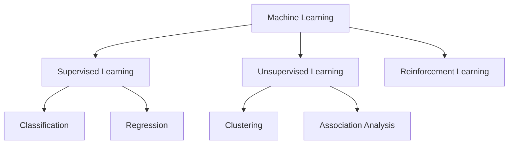
```mermaid
flowchart TD
    A[Machine Learning] --> B[Supervised Learning]
    A --> C[Unsupervised Learning]
    A --> D[Reinforcement Learning]

    B --> B1[Classification]
    B --> B2[Regression]

    C --> C1[Clustering]
    C --> C2[Association Analysis]
```

> **Yaad rakho**: Supervised = Teacher hai, Unsupervised = Khud seekhna hai, Reinforcement = Reward pe seekhna!

---

## Supervised vs Unsupervised — Kya Fark Hai?

| Aspect | Supervised Learning | Unsupervised Learning |
|--------|--------------------|-----------------------|
| **Data Type** | Labelled data (answers pata hain) | Unlabelled data (answers nahi pata) |
| **Objective** | Predict outcomes | Discover hidden structure |
| **Output** | Class labels / values | Groups / association rules |
| **Examples** | Classification, Regression | Clustering, Association |

**Real Life Example:**
- **Supervised** = Tumhari maa ne bataya "ye apple hai, ye orange hai" → ab tum khud pehchaan sakte ho 🍎🍊
- **Unsupervised** = Tumhare saamne fruits ki pile hai, koi label nahi — tum khud group kar lo shape/colour se!

---

## Unsupervised Learning Kahan Use Hota Hai? 🌍

- 🛒 **Customer Segmentation**: Amazon/Flipkart jaante hain tum kya khareedoge — tumhara shopping pattern se group banate hain
- 🚨 **Fraud Detection**: Bank dekhta hai ki ek transaction normal nahi lag rahi — anomaly detect karta hai
- 📸 **Face Recognition**: Instagram ka filter — bina label ke similar faces group karta hai
- 🧬 **Gene Analysis**: Doctors similar disease patterns wale genes ko group karte hain
- 📉 **Dimensionality Reduction**: Zyada features hain? Kam karo without losing information
- 📰 **Document Clustering**: Google News — similar articles ek saath dikhata hai
- 🤖 **AI Systems**: AI khud data se seekhti hai — bina kisi instruction ke

---

## Clustering — Kya Hota Hai? 

### Simple Definition
> **Clustering** = Similar cheezein ek group mein daalna, aur different cheezein alag group mein rakhna

Socho tumhari class mein students hain:
- **Cricket lovers** ek group 
- **Gamers** ek alag group 
- **Bookworms** ek aur group 

Kisi ne nahi bataya — **khud se similar interests wale saath aa gaye** — yahi clustering hai!

### Key Characteristics — Ek Ek Karke Samjho

1. **Unsupervised**: Koi teacher nahi, koi pre-defined answer nahi
2. **No Predefined Labels**: Algorithm khud groups dhundhta hai
3. **Reduces Complexity**: Lakh data points ko sirf 5 groups mein summarize karo
4. **Discovers Hidden Patterns**: Jo aankhon se nahi dikhta, wo algorithm dhundh leta hai
5. **Flexible Data Types**: Numbers, text, categories — sab handle kar sakta hai
6. **Scalable**: Crores of data points pe bhi kaam karta hai

---

### Clustering Ka Flow 

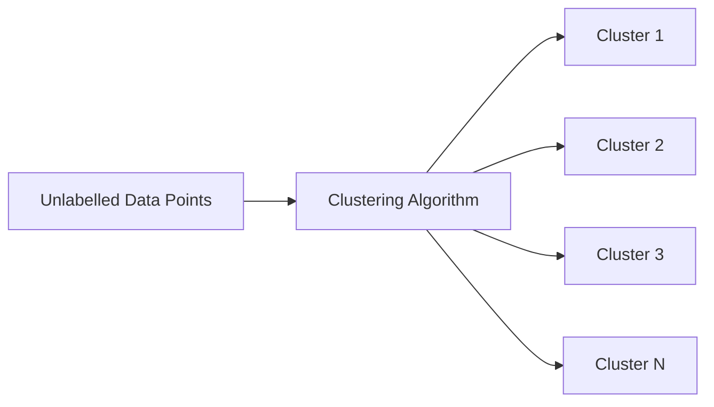
```mermaid
flowchart LR
    A[Unlabelled Data Points] --> B[Clustering Algorithm]
    B --> C1[Cluster 1]
    B --> C2[Cluster 2]
    B --> C3[Cluster 3]
    B --> C4[Cluster N]
```

---

### Clustering Ke Applications

- 🛍️ **Market Research**: Similar customers ko ek group mein daalo — targeted ads bhejo
- 📱 **Social Networks**: Facebook/Instagram pe communities detect karna
- 🎬 **Recommendation Systems**: Netflix — "tum yeh show pasand karte ho toh yeh bhi pasand aayega"
- 🏥 **Medical**: Similar symptoms wale patients ka group — same treatment suggest karo
- 🔭 **Astronomy**: Stars ko unke properties se classify karna
- 🏙️ **City Planning**: Similar land use areas ko group karna
- 🔍 **Search Engines**: Similar search results ko cluster karna

---

## Clustering Ka Real World Example 🎓

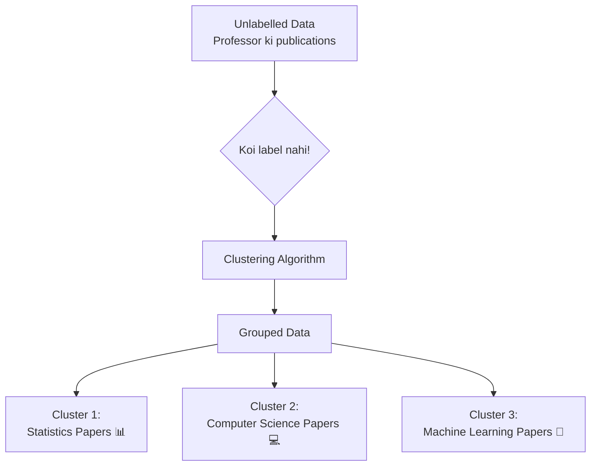
```mermaid
flowchart TD
    A[Unlabelled Data<br/>Professor ki publications] --> B{Koi label nahi!}
    B --> C[Clustering Algorithm]
    C --> D[Grouped Data]
    D --> E1[Cluster 1:<br/>Statistics Papers 📊]
    D --> E2[Cluster 2:<br/>Computer Science Papers 💻]
    D --> E3[Cluster 3:<br/>Machine Learning Papers 🤖]
```

> Papers pe koi tag nahi tha — algorithm ne **khud** topics ke basis pe group kar diya!

---

## K-Means Clustering 📍

### Pehle Samjho — K-Means Karta Kya Hai?

> **K-Means** = Data points ko **K clusters** mein divide karo, jahan har point apne **nearest centroid** ke paas ho

**Centroid** = Cluster ka center point (average of all points)

Socho tum **3 dost groups** mein divide ho rahe ho canteen mein:
- Group 1: Window ke paas baithta hai
- Group 2: Corner mein baithta hai  
- Group 3: Entrance ke paas baithta hai

Har group ka ek "center" hoga — wahi centroid hai! 🎯

---

### Complete Example — Step by Step! 📝

**Dataset:**
Points: `(1,2)`, `(2,1)`, `(1,1)`, `(2,2)`, `(6,7)`, `(7,6)`, `(7,8)`, `(8,7)`

> Dekhke hi lagta hai — kuch points (1-2 range) ek group hain, aur kuch (6-8 range) alag group hain!

---

#### Step 1: Centroids Choose Karo (Randomly)

- **C1** = `(1, 2)`
- **C2** = `(2, 1)`
- **C3** = `(7, 8)`

> Shuru mein randomly choose karte hain — baad mein improve hoga!

---

#### Step 2: Distance Calculate Karo (Iteration 1)

**Formula:**
$$d((x,y), (a,b)) = \sqrt{(x-a)^2 + (y-b)^2}$$

> Ye wahi Pythagoras theorem hai jo 10th mein padha tha! 📐

| Point | Coordinates | d to C1(1,2) | d to C2(2,1) | d to C3(7,8) | Assigned Cluster |
|-------|-------------|--------------|--------------|--------------|------------------|
| P1 | (1, 2) | 0.00 | 1.41 | 7.21 | **C1** ✅ |
| P2 | (2, 1) | 1.41 | 0.00 | 8.60 | **C2** ✅ |
| P3 | (1, 1) | 1.00 | 1.00 | 8.49 | **C1** ✅ |
| P4 | (2, 2) | 1.00 | 1.41 | 7.81 | **C1** ✅ |
| P5 | (6, 7) | 7.07 | 7.21 | 1.41 | **C3** ✅ |
| P6 | (7, 6) | 7.21 | 7.07 | 2.00 | **C3** ✅ |
| P7 | (7, 8) | 7.21 | 8.60 | 0.00 | **C3** ✅ |
| P8 | (8, 7) | 8.06 | 8.49 | 1.41 | **C3** ✅ |

> Rule: **Jis centroid se distance sabse kam** — usi cluster mein jaao!

---

#### Step 3: Cluster Assignment (Iteration 1 ke baad)

- **Cluster 1 (C1)**: `(1,2)`, `(1,1)`, `(2,2)`
- **Cluster 2 (C2)**: `(2,1)` — akela! 😅
- **Cluster 3 (C3)**: `(6,7)`, `(7,6)`, `(7,8)`, `(8,7)`

---

#### Step 4: Centroids Update Karo

> Naya centroid = Cluster ke saare points ka **average**

$$C1 = \left(\frac{1+1+2}{3}, \frac{2+1+2}{3}\right) = (1.33, 1.67)$$

$$C2 = \left(\frac{2}{1}, \frac{1}{1}\right) = (2.00, 1.00)$$

$$C3 = \left(\frac{6+7+7+8}{4}, \frac{7+6+8+7}{4}\right) = (7.00, 7.00)$$

---

#### Step 5: Distance Calculate Karo (Iteration 2)

| Point | Coordinates | d to C1(1.33,1.67) | d to C2(2.00,1.00) | d to C3(7.00,7.00) | Assigned Cluster |
|-------|-------------|--------------------|--------------------|--------------------|--------------------|
| P1 | (1, 2) | 0.47 | 1.41 | 7.21 | **C1** ✅ |
| P2 | (2, 1) | 0.94 | 0.00 | 7.81 | **C2** ✅ |
| P3 | (1, 1) | 0.75 | 1.00 | 7.21 | **C1** ✅ |
| P4 | (2, 2) | 0.75 | 1.41 | 7.07 | **C1** ✅ |
| P5 | (6, 7) | 6.78 | 7.21 | 1.00 | **C3** ✅ |
| P6 | (7, 6) | 7.16 | 7.07 | 1.00 | **C3** ✅ |
| P7 | (7, 8) | 7.93 | 8.60 | 1.00 | **C3** ✅ |
| P8 | (8, 7) | 8.25 | 8.49 | 1.00 | **C3** ✅ |

---

#### Step 6: Cluster Assignment (Iteration 2 ke baad)

- **Cluster 1 (C1)**: `(1,2)`, `(1,1)`, `(2,2)`
- **Cluster 2 (C2)**: `(2,1)`
- **Cluster 3 (C3)**: `(6,7)`, `(7,6)`, `(7,8)`, `(8,7)`

---

#### Step 7: Convergence! 🎉

> **Convergence** = Koi bhi point apna cluster nahi badal raha — algorithm ruk gaya!

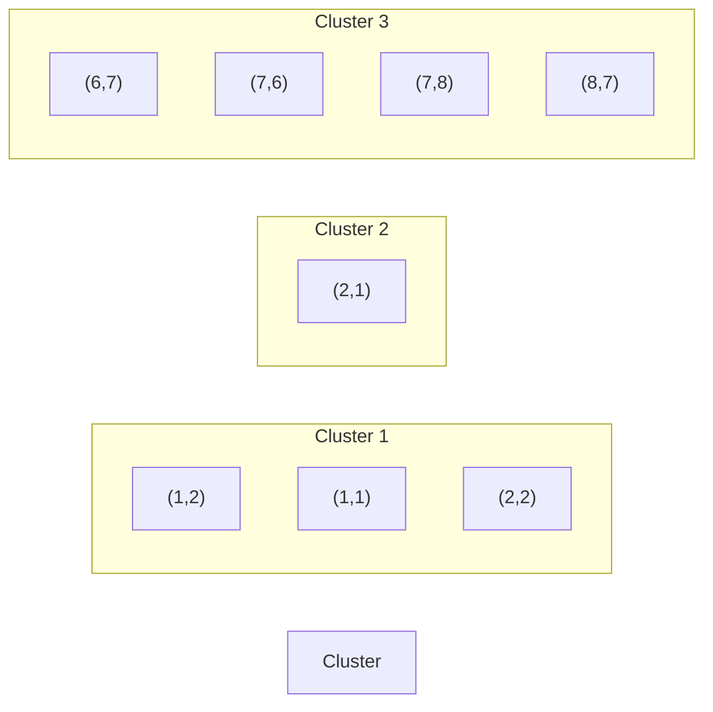
```mermaid
graph LR
    subgraph Cluster 1
    A1["(1,2)"]
    A2["(1,1)"]
    A3["(2,2)"]
    end
    
    subgraph Cluster 2
    B1["(2,1)"]
    end
    
    subgraph Cluster 3
    C1["(6,7)"]
    C2["(7,6)"]
    C3["(7,8)"]
    C4["(8,7)"]
    end
    
    style Cluster 1 fill:#d4edda
    style Cluster 2 fill:#d1ecf1
    style Cluster 3 fill:#f8d7da
```

**Converge kyun hua?**
- ✅ Koi point cluster nahi badla
- ✅ Centroids stable ho gaye
- ✅ Clusters clearly separate hain

---

## K-Means Ki Strengths aur Weaknesses 💪❌

### Strengths ✅
- **Simple**: Samajhna aur implement karna easy hai — no rocket science!
- **Fast**: Large datasets pe bhi jaldi kaam karta hai
- **Scalable**: Millions of points? No problem!
- **Converges**: Always ek answer pe pahunchta hai
- **Spherical Clusters**: Jab clusters round hote hain tab best kaam karta hai
- **Easy to Understand**: Results clearly dikhte hain

### Weaknesses ❌
- **Outliers Se Darta Hai**: Ek bhi outlier poora centroid hila deta hai
- **Spherical Assumption**: Crescent ya S-shape clusters? Fail ho jaata hai
- **Equal Size Assumption**: Unequal size clusters mein galat results
- **K Pehle Batana Padta Hai**: Kitne clusters chahiye? Ye pehle se decide karna padta hai
- **Local Optima**: Different starting points → different results

---

## K-Means Ki Problems aur Unke Solutions 🔧

| Problem | Solution |
|---------|----------|
| **Galat initial centroids** | **K-Means++** use karo — smart initialization |
| **K nahi pata** | **Elbow Method** ya **Silhouette Score** use karo |
| **Outliers** | **K-Medoids (PAM)** use karo |
| **Non-spherical clusters** | **DBSCAN** ya **Hierarchical** use karo |
| **Categorical data** | **K-Modes** use karo |
| **Local optima** | Multiple times run karo, best result lo |
| **Unequal cluster sizes** | **EM Algorithm** use karo |
| **High dimensions** | **PCA ya t-SNE** se pehle reduce karo |

---

## Within Cluster Homogeneity aur Heterogeneity 🎯

> **Simple Words Mein**:
> - **Homogeneity** = Ek cluster ke andar ke points **kitne similar** hain
> - **Heterogeneity** = Ek cluster ke andar ke points **kitne different** hain

**Goal kya hai?**
- ✅ **Homogeneity Badhao** → Points ek doosre ke paas hone chahiye
- ❌ **Heterogeneity Hatao** → Points ek doosre se zyada different nahi hone chahiye

**Real life**: Ek cricket team mein saare players cricket lovers hain (high homogeneity) — koi random person nahi (low heterogeneity)! 🏏

---

## K (Number of Clusters) Kaise Choose Karein? 🔢

> **Koi fixed formula nahi hai!** — lekin kuch tricks hain

### Small Datasets Ke Liye:

$$K = \sqrt{\frac{n}{2}}$$

Jahan $n$ = total data points

**Example**: 50 points hain → $K = \sqrt{25} = 5$ clusters

### Large Datasets Ke Liye:
- **Elbow Method** ← Sabse popular!
- Silhouette Score
- Gap Statistic
- Davies-Bouldin Index

---

## Elbow Method — Best K Kaise Dhundho? 📈

> **Elbow Method** = Graph dekho, "elbow" (kuhni) jaisi shape kahan ban rahi hai — wahi optimal K hai!

### Concept:
- **Kam K** → **Underfitting** (groups bahut bade, inaccurate)
- **Zyada K** → **Overfitting** (itne groups ki koi matlab nahi)

**K badhane par:**
- Homogeneity badhti hai ↑
- Heterogeneity kam hoti hai ↓
- Ek point ke baad K badhane se **koi fayda nahi** (diminishing returns)

### Elbow Point = Optimal K!

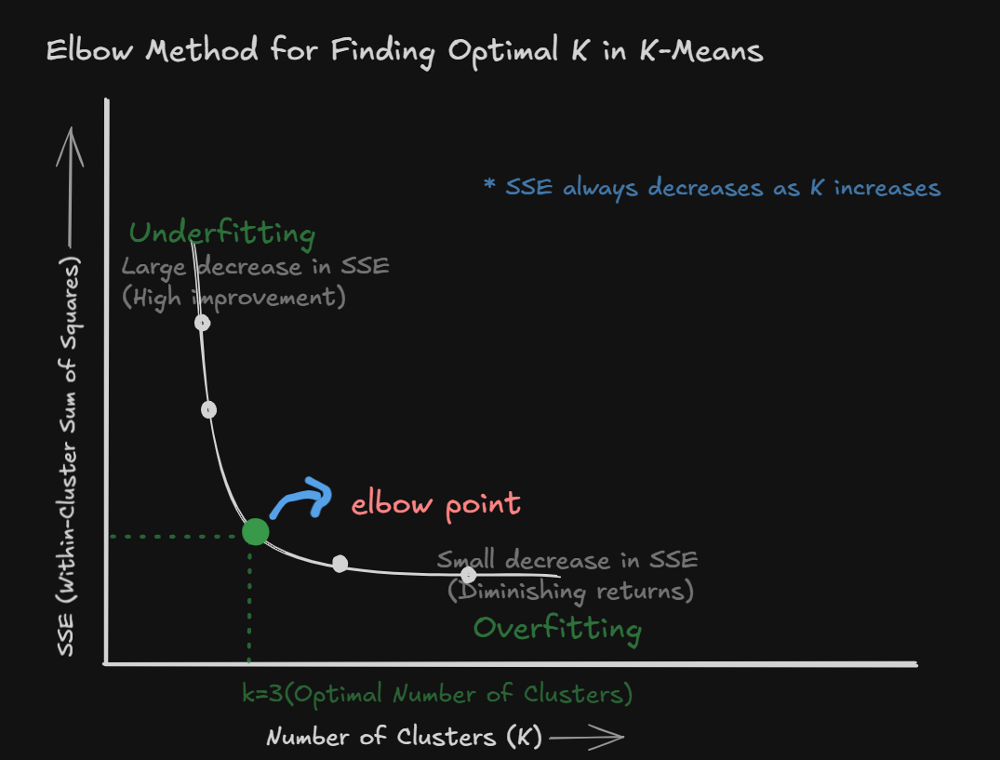

*Graph mein SSE vs K plot karo — jahan curve mein "kuhni" bane, wahi K sabse best hai. Is case mein K=3!*

---

## Initial Centroids Choose Karna — Kyun Important Hai? 🎯

> **Galat starting point → Galat answer!** Isliye initial centroids sahi hone chahiye

### Random Selection Ki Problems:
- ❌ Zyada SSE (Sum of Squared Errors)
- ❌ Sub-optimal clusters bante hain
- ❌ Baar baar run karo tab bhi optimal nahi milta

### Better Approaches:

#### 1. Hierarchical Clustering Initialization
- Pehle hierarchical clustering se K clusters nikalo
- Un clusters ke centroids ko K-Means ka starting point banao
- ✅ Small datasets ke liye best hai

#### 2. Advanced Methods
- **K-Means++**: Spread out initial centroids — smart choice karta hai
- **Bisecting K-Means**: Hierarchical tarike se K-Means karta hai
- **Post-processing**: Baad mein refine karte hain

---

## SSE — Clustering Ki Quality Measure Karo 📏

### Euclidean Distance Formula:

$$\text{dist}(x, c) = \sqrt{\sum_{i=1}^{n}(x_i - c_i)^2}$$

### SSE Formula:

$$\text{SSE} = \sum_{k=1}^{K} \sum_{x \in C_k} \text{dist}(x, c_k)^2$$

**Simple meaning**: Har point ka apne centroid se distance squared — sab add karo

### Key Points:
- ✅ **Kam SSE** = Better clustering
- ✅ SSE minimize karne wala centroid = **cluster ka mean**
- ⚠️ **Problem**: SSE outliers se bahut affect hota hai

### K-Means Ka Result Depend Karta Hai:
1. **Initial centroid selection** par
2. **K ki value** par

### Reliability Improve Karne Ke Liye:
- Multiple times run karo with different starting centroids
- K vary karo aur best dekho
- Clustering ko classification se **pehle** use karo unlabeled data ke subgroups dhundhne ke liye

---

## K-Means Complexity ⏱️

$$O(nKt)$$

Jahan:
- $n$ = total data points
- $K$ = clusters ki sankhya
- $t$ = iterations

> 💡 K aur t usually n se bahut chhote hote hain → isliye K-Means **fast aur scalable** hai!

---

## Voronoi Boundaries — Ek Cool Visualization 🗺️

> **Voronoi Boundary** = Wo line jo decide karti hai ki kaunsa point kis cluster mein jaayega

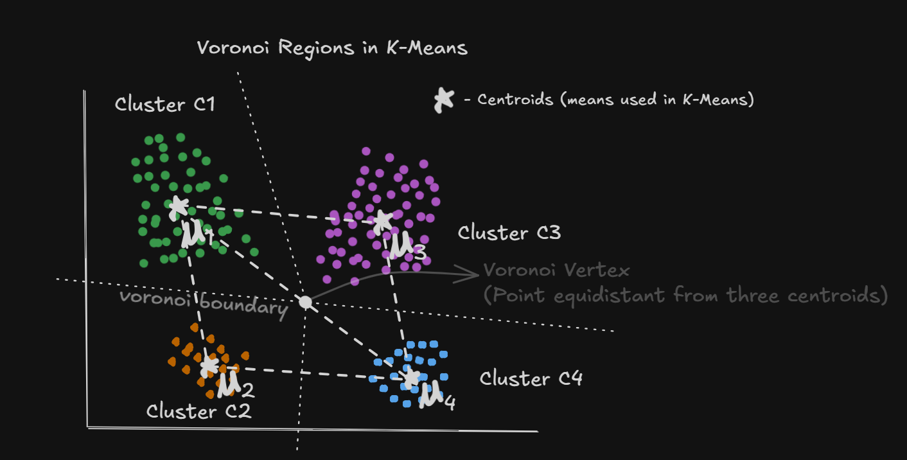

*4 clusters (C1, C2, C3, C4) hain — Voronoi boundaries har region ko separate karti hain. Har region mein sirf wahi points hain jo us cluster ke centroid ke sabse paas hain.*

**Key Observations:**
1. Final clusters initial centroid selection pe bahut depend karte hain
2. Multiple runs se better global results milte hain
3. Practical use: **Software Defect Clustering** — bugs ko categories mein group karna

---

## K-Means Ka Problem — Outliers! 😱

### Example: Outlier Ka Asar

**Dataset (1D):** `[1, 2, 3, 5, 9, 10, 11, 25]`

> **25 ek outlier hai** — ye ek akela point hai jo bahut door hai baki points se!

**K = 2 leke clusters banao:**
- **Cluster 1**: `{1, 2, 3, 5}`
- **Cluster 2**: `{9, 10, 11, 25}`

---

### K-Means (Mean Use Karta Hai):

$$c_1 = \frac{1 + 2 + 3 + 5}{4} = 2.75$$

$$c_2 = \frac{9 + 10 + 11 + 25}{4} = 13.75$$

**Problem:**
- Cluster 2 ka centroid **13.75** ho gaya
- Lekin actual points hain 9, 10, 11 — centroid inse bahut door hai!
- Outlier 25 ne centroid ko **kheench liya** — yahi problem hai! 🙁

---

### K-Medoids (Actual Data Point Use Karta Hai):

> **Medoid** = Cluster ka woh actual point jo baaki saare points se minimum distance pe ho

**Cluster 2 ke liye medoid dhundho:**

| Candidate Medoid | Calculation | Total Distance |
|-----------------|-------------|----------------|
| 9 | \|9-9\|+\|10-9\|+\|11-9\|+\|25-9\| | 0+1+2+16 = **19** |
| 10 | \|9-10\|+\|10-10\|+\|11-10\|+\|25-10\| | 1+0+1+15 = **17** ✅ |
| 11 | \|9-11\|+\|10-11\|+\|11-11\|+\|25-11\| | 2+1+0+14 = **17** ✅ |
| 25 | \|9-25\|+\|10-25\|+\|11-25\|+\|25-25\| | 16+15+14+0 = **45** |

**Medoid = 10** (actual data point — outlier 25 ka koi zyada asar nahi!)

---

## K-Medoids — Representative Object Technique 🏆

### Definition:
- **Actual data points** ko cluster representative banata hai (centroid nahi!)
- Har point apne **nearest medoid** ke cluster mein jaata hai

### SSE Formula:

$$\text{SSE} = \sum_{i=1}^{K} \sum_{x \in C_i} \text{dist}(o_i, x)^2$$

Jahan $o_i$ = medoid of cluster $C_i$

---

## PAM Algorithm — K-Medoids Ka Tarika 🔄

### Steps (Simple Language Mein):

1. **Initialize**: Random K points ko medoid choose karo
2. **Assign**: Baaki saare points ko nearest medoid ke cluster mein daalo
3. **Swap karo aur check karo**:
   - Ek non-medoid point $o'$ lo
   - Current medoid $o_i$ se swap karo
   - Naya SSE calculate karo
   - **Agar** $SSE_{new} < SSE_{old}$ → swap rakh lo, nahin toh wapas lo
4. **Repeat** jab tak koi improvement nahi

### Pseudocode:
```
PAM Algorithm:
1. SELECT K random points as initial medoids
2. REPEAT:
     FOR each medoid o_i:
         FOR each non-medoid point o':
             SWAP o_i with o'
             COMPUTE SSE_new
             IF SSE_new < SSE_old:
                 KEEP the swap
                 UPDATE medoid to o'
                 REASSIGN all points to nearest medoid
3. UNTIL no change in medoids
```

### Time Complexity:

$$O(K(n-K)^2)$$

### Advantages ✅
- Outliers aur noise ke baare mein **robust** hai
- Kisi bhi distance metric ke saath kaam karta hai
- Medoids actual data points hain — **interpretable**!

### Limitations ❌
- Large datasets pe **slow** hai
- Large data ke liye sampling approaches chahiye
- K-Means se **zyada costly** computationally

---

## K-Means vs K-Medoids — Final Showdown! ⚔️

| Aspect | K-Means | K-Medoids (PAM) |
|--------|---------|-----------------|
| **Representative** | Centroid (mean — imaginary point) | Medoid (actual data point) |
| **Calculation** | Mean of all points | Point minimizing total distance |
| **Outliers** | ❌ Bahut sensitive | ✅ Robust |
| **Cluster Shape** | Spherical best | Thoda better |
| **Speed** | $O(nKt)$ — Fast ✅ | $O(K(n-K)^2)$ — Slow ❌ |
| **Scalability** | ✅ Large data ke liye best | ❌ Small/medium datasets |
| **Distance Metric** | Mainly Euclidean | Any metric |
| **Interpretability** | Centroid real point nahi | ✅ Medoid real point hai |
| **Noise** | ❌ Poor | ✅ Better |
| **Convergence** | Always ✅ | Always ✅ |
| **Use Case** | Clean, large, spherical data | Noisy, small, outlier-prone data |
| **Memory** | Kam | Zyada |
| **Implementation** | Simple | Complex |

---

## Teen Types Ke Clustering Algorithms 🌳

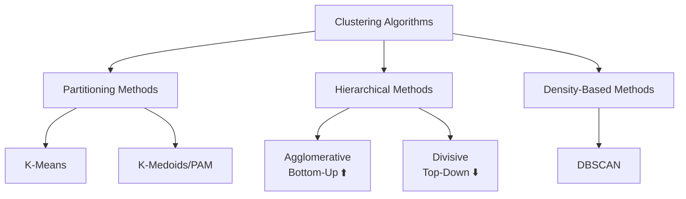
```mermaid
flowchart TD
    A[Clustering Algorithms] --> B[Partitioning Methods]
    A --> C[Hierarchical Methods]
    A --> D[Density-Based Methods]
    
    B --> B1[K-Means]
    B --> B2[K-Medoids/PAM]
    
    C --> C1[Agglomerative<br/>Bottom-Up ⬆️]
    C --> C2[Divisive<br/>Top-Down ⬇️]
    
    D --> D1[DBSCAN]
```

---

## Hierarchical Clustering 🌲

> **Simple analogy**: Family tree jaisa — dadi se maa, maa se tum — hierarchy!

### Definition:
Data ko **tree-like structure (hierarchy)** mein group karna — fixed clusters nahi, ek poora tree!

**Kab use karein?** Jab data mein **nested groups** hoon — jaise company → department → team → employee

### Applications:
- 🏢 **Office**: Company → Department → Teams → Employees
- 🧬 **Biology**: Kingdom → Phylum → Class → Order → Species
- 📰 **Documents**: Topic → Subtopic → Articles
- 👥 **Social Networks**: Community ke andar sub-communities

---

## Agglomerative vs Divisive — Dono Tarike 🔄

### 1. Agglomerative (Bottom-Up) ⬆️

> **Sochna ka tarika**: Akele akele shuru karo — phir dheere dheere milte jao!

Jaise school ke pehle din — sabke apne group nahi hote, phir dheere dheere dost bante hain aur groups bante hain! 😄

```
Level 0: {A} {B} {C} {D} {E}     ← Sab akele (5 clusters)
Level 1: {AB} {C} {D} {E}        ← A aur B mil gaye (4 clusters)
Level 2: {AB} {CD} {E}           ← C aur D mil gaye (3 clusters)
Level 3: {AB} {CDE}              ← CD aur E mil gaye (2 clusters)
Level 4: {ABCDE}                 ← Sab ek! (1 cluster)
```

---

### 2. Divisive (Top-Down) ⬇️

> **Sochna ka tarika**: Sab saath shuru karo — phir dheere dheere alag hote jao!

Jaise ek badi family hoti hai — phir bache bade hote hain aur apne ghar jaate hain, family split hoti hai! 👨‍👩‍👧‍👦

```
Level 0: {ABCDE}                 ← Sab saath (1 cluster)
Level 1: {AB} {CDE}              ← Pehla split (2 clusters)
Level 2: {AB} {CD} {E}           ← Doosra split (3 clusters)
Level 3: {A} {B} {CD} {E}        ← Teesra split (4 clusters)
Level 4: {A} {B} {C} {D} {E}     ← Sab akele (5 clusters)
```

---

## Dendrogram — Tree Diagram Samjho 🌳

> **Dendrogram** = Ek tree diagram jo dikhata hai **step by step kaise clusters bane ya tute**

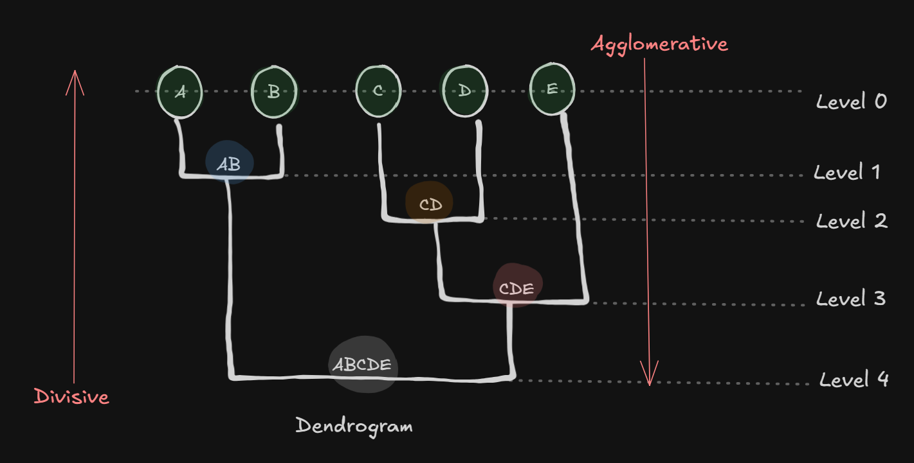

*Dendrogram mein agglomerative clustering neeche se upar jaati hai — pehle individual points (A,B,C,D,E), phir sab milke ABCDE bante hain. Jitna upar merge hota hai, utna zyada distance pe merge hota hai.*

### Dendrogram Ko Padhna Seekho:
- **Y-axis (Height)**: Distance between clusters — jitna upar, utne door
- **X-axis**: Individual data points
- **Horizontal Lines**: Kab merge hua
- **Vertical Lines**: Kaunse clusters mile

### Dendrogram Kaato (Cut) — Apna K Choose Karo! ✂️

> Khubsoorat baat ye hai — **baad mein decide kar sakte ho** kitne clusters chahiye!

- **Level 2 pe kaato** → 3 clusters milenge: `{AB}`, `{CD}`, `{E}`
- **Level 3 pe kaato** → 2 clusters milenge: `{AB}`, `{CDE}`

---

## Distance Measures Between Clusters 📏

Clusters ke beech distance measure karne ke **4 tarike** hain:

Let $C_i$ aur $C_j$ do clusters hain jahan:
- $n_i$, $n_j$ = points ki count
- $m_i$, $m_j$ = means (centroids)

### 1. Single Linkage (Minimum Distance)

$$D_{\text{min}}(C_i, C_j) = \min_{p \in C_i, q \in C_j} d(p, q)$$

> Dono clusters ke **sabse paas wale points** ki distance

---

### 2. Complete Linkage (Maximum Distance)

$$D_{\text{max}}(C_i, C_j) = \max_{p \in C_i, q \in C_j} d(p, q)$$

> Dono clusters ke **sabse door wale points** ki distance

---

### 3. Average Linkage (Mean Distance)

$$D_{\text{avg}}(C_i, C_j) = \frac{1}{n_i \times n_j} \sum_{p \in C_i} \sum_{q \in C_j} d(p, q)$$

> **Saare pairs ki distance ka average** — balanced approach!

---

### 4. Centroid Distance

$$D_{\text{centroid}}(C_i, C_j) = d(m_i, m_j)$$

> Dono clusters ke **centers** ke beech ki distance

---

## Distance Visualization 👁️

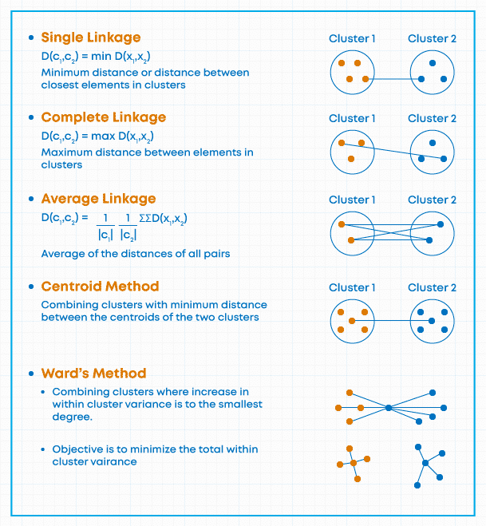

*Diagram mein 5 methods dikhaye hain:*
1. **Single Linkage**: Closest elements ki minimum distance
2. **Complete Linkage**: Farthest elements ki maximum distance
3. **Average Linkage**: Saare pairs ka average
4. **Centroid Method**: Cluster centers ke beech distance
5. **Ward's Method**: Within-cluster variance minimize karo

---

## Hierarchical Clustering Ki Important Baatein 📌

1. **Bottom-Up vs Top-Down**: Agglomerative milata hai, Divisive todta hai
2. **No Swaps**: Ek baar merge/split ho gaya — **wapas nahi ja sakte!** (permanent decision)
3. **Termination**: Ya toh threshold distance pe ruk jao, ya desired K pe
4. **Dendrogram**: Poori journey visualize kar sakte ho
5. **K advance mein nahi batana**: K-Means se ye **advantage** hai!

---

## Linkage Methods — Kab Kya Use Karein? 🤔

### 1. Single Linkage (Nearest Neighbor) 🔗

**Method**: $D_{\text{min}}$ pe merge karo

**Characteristics:**
- Closest pair of points use karta hai
- ⚠️ **Chaining problem**: Ek chain bana deta hai — connected ho jaate hain aise points jo naturally alag hone chahiye
- ⚠️ Outliers se sensitive

### Example (Correct Version):

**Initial objects:** `A  B  C  D  E`

```
Distances:
- d(C,D) = 1  ← Sabse kam!
- d(A,B) = 2
- d(AB, CDE) = 3

Step 1: CD merge → Dmin = 1 (sabse minimum!)
Result: {A} {B} {CD} {E}

At Level 1:
- Dmin(CD, E) = 1  ← Ab ye minimum!
- Dmin(A, B) = 2
- Dmin(AB, E) = 3

Step 2: CD aur E merge → Dmin = 1
Result: {AB} {CDE}

Step 3: AB aur CDE merge → Dmin = 3 (last merge!)
Result: {ABCDE}
```

**Visual:**


*Level 0 mein individual points hain, Level 1 pe AB aur CD form hote hain, phir CDE banta hai kyunki D,E ka Dmin=1 sabse minimum tha.*

---

### 2. Complete Linkage (Furthest Neighbor) 🔗

**Method**: $D_{\text{max}}$ pe merge karo

**Characteristics:**
- Farthest pair of points use karta hai
- ✅ **Compact, tight clusters** banta hai
- ⚠️ Outliers clusters ko merge hone se rok sakte hain
- Chaining effect avoid hota hai

---

### 3. Average Linkage (Mean) ⚖️

**Method**: $D_{\text{avg}}$ use karo

**Characteristics:**
- Single aur Complete ka **middle ground**
- ✅ More stable, less sensitive to outliers
- ✅ Most practical scenarios mein best kaam karta hai

**Kyun better hai?**
- Single linkage → Chaining ❌
- Complete linkage → Too strict ❌
- Average linkage → **Just right** ✅ (Goldilocks approach! 😄)

---

## Linkage Methods Ka Comparison 📊

| Linkage | Distance | Fayde | Nuksan | Best For |
|---------|----------|-------|--------|----------|
| **Single** | $D_{\text{min}}$ | Simple, non-spherical clusters find kar sakta | Chaining; Outliers se sensitive | Well-separated clusters |
| **Complete** | $D_{\text{max}}$ | Compact clusters; No chaining | Outliers se sensitive | Spherical clusters |
| **Average** | $D_{\text{avg}}$ | Balanced; Outliers se robust | Moderate cost | General purpose ✅ |
| **Centroid** | $D_{\text{centroid}}$ | Intuitive; Fast | Dendrogram inversions | Large, clear clusters |

---

## Density-Based Clustering: DBSCAN 🌊

### Problem Pehle Samjho!

> K-Means aur Hierarchical dono **spherical clusters** mante hain — matlab circular/ball-shaped

**Real world mein clusters aisi shapes le sakte hain:**
- 🌙 Crescent shape
- 〰️ S-shape
- Irregular boundaries

**Example**: Tumhara city ka map — roads ke saath saath log rehte hain — ye S-shaped cluster hai, not circular! 🗺️

**K-Means isko handle nahi kar sakta** — DBSCAN kar sakta hai! 💪

---

## DBSCAN Algorithm 🔍

**Full Form**: **D**ensity-**B**ased **S**patial **C**lustering of **A**pplications with **N**oise

> **Simple Idea**: Jahan bheed zyada ho (dense region) — wahan cluster hai. Jahan koi akela ho (sparse region) — woh noise hai!

---

### Key Concepts — Teen Important Cheezein

#### 1. Eps (ε) — Epsilon
> Ek point ke around **kitni door tak dekhna hai** — radius of neighborhood

#### 2. MinPts — Minimum Points
> Ek region ko "dense" kehne ke liye **kitne points minimum chahiye**

#### 3. Point Types — Teen Tarah Ke Points

**Core Point (Laal/Red)** 🔴
- Apne Eps radius mein **≥ MinPts** points hain
- Cluster ka "center" hota hai
- Ye cluster ka main member hai

**Border Point (Neela/Blue)** 🔵
- Kisi Core Point ke Eps radius mein hai
- Khud ke paas **< MinPts** points hain
- Cluster ka member hai, but center nahi

**Noise Point (X mark)** ✖️
- Kisi bhi Core Point ke radius mein nahi
- **Kisi cluster ka part nahi**
- Outlier hai!

---

### DBSCAN Ka Algorithm

```
DBSCAN(D, Eps, MinPts):
1. Sabhi points ko "unvisited" mark karo
2. Har unvisited point p ke liye:
     a. p ko visited mark karo
     b. p ke Eps radius mein saare neighbors dhundho
     c. Agar neighbors < MinPts:
           p ko NOISE mark karo
        Warna:
           Naya cluster C banao
           p ko C mein daalo (p core point hai)
           Har neighbor q ke liye:
               Agar q unvisited hai:
                  q ko visited mark karo
                  q ke neighbors dhundho
                  Agar q ke neighbors >= MinPts:
                     Unhe bhi expansion list mein daalo
               Agar q kisi cluster mein nahi:
                  q ko C mein daalo
3. Saare clusters return karo
```

---

### DBSCAN Visualization

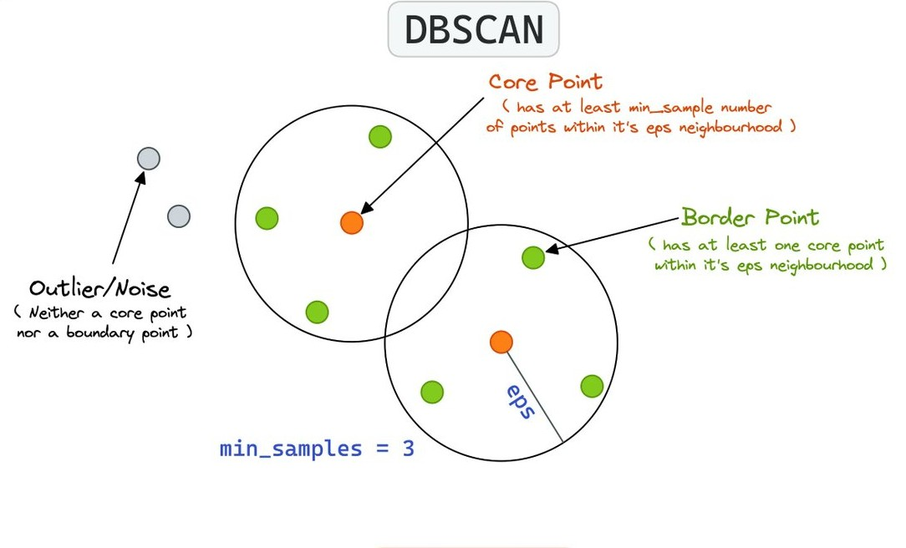

*Diagram mein:*
- 🔴 *Red circles: Core Points (≥3 neighbors within Eps)*
- 🔵 *Blue dots: Border Points (Core ke paas hain, but core nahi)*
- ✖️ *Gray X marks: Noise Points (kisi cluster mein nahi)*
- *Cluster 1: Circular shape (left)*
- *Cluster 2: Crescent/moon shape (right) — K-Means ye nahi kar sakta!*

---

## DBSCAN Ke Advantages aur Disadvantages

### Advantages ✅
- **Arbitrary shapes**: S-shape, crescent — sab handle karta hai (K-Means fail hota hai yahan!)
- **K nahi batana**: Khud decide karta hai kitne clusters hain
- **Outlier detection**: Automatically noise points identify karta hai
- **Varying sizes**: Different sizes ke clusters handle karta hai
- **Single scan**: Database ek baar scan karta hai — efficient!

### Disadvantages ❌
- **Eps aur MinPts choose karna mushkil**: Sahi values dhundhna tricky hai
- **Varying density**: Agar clusters ki density bahut different hai toh problem hoti hai
- **High dimensions**: Bahut saare features pe performance kharab ho jaati hai
- **Border point ambiguity**: Ek border point do clusters ka member ho sakta hai
- **Memory**: Large datasets ke liye memory zyada chahiye

---

## Teen Methods Ka Final Comparison 🏆

| Aspect | Partitioning (K-Means, PAM) | Hierarchical (Agglo, Divisive) | Density (DBSCAN) |
|--------|----------------------------|-------------------------------|-----------------|
| **Cluster Shape** | Sirf Spherical ⭕ | Spherical preferred | Koi bhi shape ✅ |
| **K Specify Karna** | Haan, pehle batao | Baad mein dendrogram se decide karo | Nahi chahiye ✅ |
| **Outlier Handling** | Sab points assign karta hai | Sab points assign karta hai | Noise identify karta hai ✅ |
| **Speed** | Fast: O(nKt) ✅ | Slow: O(n²log n) ❌ | Moderate: O(n log n) |
| **Visualization** | Scatter plot | Dendrogram tree | Scatter with noise |
| **Deterministic** | Nahi (random init) ❌ | Haan ✅ | Haan ✅ |
| **Scalability** | Excellent ✅ | Poor ❌ | Good |
| **Best For** | Large, spherical clusters | Hierarchical relationships | Arbitrary shapes, noise |

---

## Kaunsa Method Kab Use Karein? 🤔

### K-Means Use Karo Jab:
- ✅ Clusters roughly spherical hain
- ✅ K pata hai
- ✅ Bahut bada dataset hai
- ✅ Speed important hai

### K-Medoids Use Karo Jab:
- ✅ Data mein outliers hain
- ✅ Actual data points as representatives chahiye
- ✅ Non-Euclidean distance use karna hai
- ✅ Small/medium dataset hai

### Hierarchical Use Karo Jab:
- ✅ Data ka hierarchy samajhna hai
- ✅ K advance mein nahi pata
- ✅ Visual tree structure chahiye
- ✅ Small dataset hai

### DBSCAN Use Karo Jab:
- ✅ Clusters arbitrary shapes mein hain
- ✅ Noise aur outliers data mein hain
- ✅ K nahi pata
- ✅ Clusters similar density ke hain

---

> ## 🎯 Ek Line Summary
> - **K-Means** = Fast hai, spherical clusters ke liye best, lekin outliers se darta hai
> - **K-Medoids** = Outliers se nahi darta, lekin slow hai
> - **Hierarchical** = Tree banata hai, K pehle nahi batana, lekin slow hai
> - **DBSCAN** = Koi bhi shape handle karta hai, outliers ko noise kehta hai, K nahi chahiye

---
---

## Association Rule Mining 🛒

### Real Life Se Samjho!

Socho tum ek **grocery store** ke owner ho.  
Tumhare paas hazaron customers ka data hai - **kya kya kharida unhone**.  
Tum dekhna chahte ho: **"Jo log Bread lete hain, kya woh Milk bhi lete hain?"**

Yahi hai **Association Rule Mining** — data mein **hidden relationships** dhundhna!

> 💡 **Simple Definition**: Association Rule Mining ek technique hai jo large datasets mein **interesting relationships** ya **patterns** dhundhti hai.

---

### Hamare Transactions (Data)

Maano ye hai humara grocery store ka data:

| Transaction | Items Bought |
|-------------|-------------|
| T1 | Bread, Milk, Egg, Butter, Salt, Apple |
| T2 | Bread, Milk, Egg, Apple |
| T3 | Bread, Milk, Butter, Apple |
| T4 | Milk, Egg, Butter, Apple |
| T5 | Bread, Egg, Salt |
| T6 | Bread, Milk, Egg, Apple |

Yahi data hum **0 aur 1** mein convert karte hain — item hai toh **1**, nahi hai toh **0**:

| Transaction | Apple | Bread | Butter | Egg | Milk | Salt |
|-------------|-------|-------|--------|-----|------|------|
| T1 | 1 | 1 | 1 | 1 | 1 | 1 |
| T2 | 1 | 1 | 0 | 1 | 1 | 0 |
| T3 | 1 | 1 | 1 | 0 | 1 | 0 |
| T4 | 1 | 0 | 1 | 1 | 1 | 0 |
| T5 | 0 | 1 | 0 | 1 | 0 | 1 |
| T6 | 1 | 1 | 0 | 1 | 1 | 0 |

---

### Applications Kahan Use Hota Hai?

- 🛒 **Market Basket Analysis**: Amazon ka "Frequently Bought Together"
- 🏥 **Medical Diagnosis**: Symptoms se disease predict karna
- 🌐 **Web Mining**: Netflix/YouTube recommendations
- 🔬 **Scientific Data Analysis**: Gene patterns dhundhna

---

## Common Terminologies

### 1. Itemset
> Ek ya zyada items ka group jo transactions mein saath aate hain

- `{Bread}` → 1-itemset
- `{Bread, Milk}` → 2-itemset  
- `{Bread, Milk, Egg}` → 3-itemset

Mathematically:
$$I = \bigcup_{t_i \in T} t_i$$

---

### 2. Association Rule

> Ek expression **X → Y** jahan X aur Y **disjoint itemsets** hain  
> Matlab: **X ∩ Y = ∅** (X aur Y mein koi common item nahi)

**Example:**
```
{Bread, Milk} → {Egg}
```
Iska matlab: **"Jo log Bread aur Milk khareedtey hain, woh Egg bhi khareedtey hain"**

---

### 3. Support Count

> Kitne transactions mein ek particular itemset aaya — **simple count hai ye**

$$\sigma(X) = |\{t_i \mid X \subseteq t_i\}|$$

**Example se samjho:**

| Itemset | Transactions Mein Hai | Support Count |
|---------|----------------------|---------------|
| {Bread} | T1, T2, T3, T5, T6 | 5 |
| {Milk} | T1, T2, T3, T4, T6 | 5 |
| {Egg} | T1, T2, T4, T5, T6 | 5 |
| {Butter} | T1, T3, T4 | 3 |
| {Apple} | T1, T2, T3, T4, T6 | 5 |
| {Salt} | T1, T5 | 2 |

---

### 4. Frequent vs Infrequent Itemset

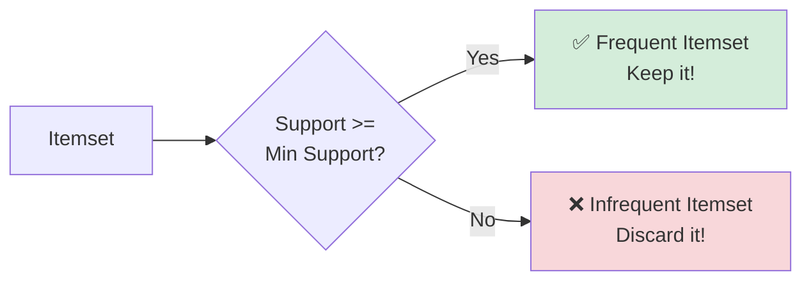
```mermaid
flowchart LR
    A[Itemset] --> B{Support >= \nMin Support?}
    B -->|Yes| C[✅ Frequent Itemset\nKeep it!]
    B -->|No| D[❌ Infrequent Itemset\nDiscard it!]
    style C fill:#d4edda
    style D fill:#f8d7da
```

> **Goal**: Saare possible rules mein se **strong rules** rakhna aur **weak rules** hatana

---

## Support aur Confidence

> Ye dono milke decide karte hain ki koi rule **strong hai ya weak**

---

### Support (Rule Kitna Common Hai?)

> Support batata hai ki **rule dataset mein kitni baar apply hota hai**

$$\text{Support}(X \rightarrow Y) = \frac{\sigma(X \cup Y)}{N}$$

Jahan $N$ = total transactions = 6

**Example:**
$$\text{Support}(\{Bread\} \rightarrow \{Milk\}) = \frac{\sigma(\{Bread, Milk\})}{6} = \frac{4}{6} = 0.67$$

> 💡 Low support = rule shayad **coincidence** se aaya hai

---

### Confidence (Rule Kitna Accurate Hai?)

> Confidence batata hai: **"Jo log X khareedtey hain, unme se kitne Y bhi khareedtey hain?"**

$$\text{Confidence}(X \rightarrow Y) = \frac{\sigma(X \cup Y)}{\sigma(X)}$$

**Example:**
$$\text{Confidence}(\{Bread\} \rightarrow \{Milk\}) = \frac{\sigma(\{Bread, Milk\})}{\sigma(\{Bread\})} = \frac{4}{5} = 0.80$$

> 💡 Iska matlab: **"80% chance hai ki jis ne Bread liya, usne Milk bhi liya"**

---

### Complete Calculations Table (N = 6)

#### Individual Item Support:

| Item | Frequency (Count) | Support |
|------|------------------|---------|
| Apple | 5 | 5/6 = 0.833 |
| Bread | 5 | 5/6 = 0.833 |
| Butter | 3 | 3/6 = 0.500 |
| Egg | 5 | 5/6 = 0.833 |
| Milk | 5 | 5/6 = 0.833 |
| Salt | 2 | 2/6 = 0.333 |

#### Itemset Support:

| Itemset | Count | Support |
|---------|-------|---------|
| {Bread, Milk} | 4 | 4/6 = 0.667 |
| {Bread, Egg} | 4 | 4/6 = 0.667 |
| {Bread, Apple} | 4 | 4/6 = 0.667 |
| {Milk, Butter} | 3 | 3/6 = 0.500 |
| {Milk, Egg} | 4 | 4/6 = 0.667 |
| {Milk, Apple} | 5 | 5/6 = 0.833 |
| {Apple, Butter} | 3 | 3/6 = 0.500 |
| {Egg, Apple} | 4 | 4/6 = 0.667 |

---

#### Confidence of Association Rules:

**Rule 1: {Bread} → {Milk}**
$$\text{Confidence} = \frac{\text{Support}(\{Bread, Milk\})}{\text{Support}(\{Bread\})} = \frac{0.667}{0.833} = 0.80$$

**Rule 2: {Milk} → {Apple}**
$$\text{Confidence} = \frac{\text{Support}(\{Milk, Apple\})}{\text{Support}(\{Milk\})} = \frac{0.833}{0.833} = 1.00$$

**Rule 3: {Bread, Milk} → {Egg}**
$$\text{Confidence} = \frac{\text{Support}(\{Bread, Milk, Egg\})}{\text{Support}(\{Bread, Milk\})} = \frac{0.50}{0.667} = 0.75$$

**Rule 4: {Egg} → {Bread}**
$$\text{Confidence} = \frac{\text{Support}(\{Egg, Bread\})}{\text{Support}(\{Egg\})} = \frac{0.667}{0.833} = 0.80$$

**Rule 5: {Apple} → {Milk}**
$$\text{Confidence} = \frac{\text{Support}(\{Milk, Apple\})}{\text{Support}(\{Apple\})} = \frac{0.833}{0.833} = 1.00$$

---

#### Summary Table of Association Rules:

| Rule | Support | Confidence | Strong? (minS=0.5, minC=0.7) |
|------|---------|------------|-------------------------------|
| {Bread} → {Milk} | 0.667 | 0.800 | ✅ Yes |
| {Milk} → {Apple} | 0.833 | 1.000 | ✅ Yes |
| {Bread, Milk} → {Egg} | 0.500 | 0.750 | ✅ Yes |
| {Egg} → {Bread} | 0.667 | 0.800 | ✅ Yes |
| {Apple} → {Milk} | 0.833 | 1.000 | ✅ Yes |

> 💡 **Strong Rule** = Support ≥ minSupport **AND** Confidence ≥ minConfidence

---

## The Apriori Algorithm 🔑

### Threshold Set Karo Pehle!

Apriori algorithm mein hum pehle **do thresholds** set karte hain:
- **Minimum Support (minS)** = 0.5 (50%)
- **Minimum Confidence (minC)** = 0.7 (70%)

> Isse kam wale rules **weak** maane jaate hain aur discard ho jaate hain

---

### Core Idea: Apriori Property

> **"Agar ek itemset frequent nahi hai, toh uska koi bhi superset bhi frequent nahi hoga"**

**Simple example:**
```
Agar {Bread, Salt} frequent nahi hai
Toh {Bread, Salt, Milk} bhi frequent nahi hoga — automatically discard!
```

Yahi pruning hai — isse time bachta hai! ✂️

---

### Key Steps in Apriori

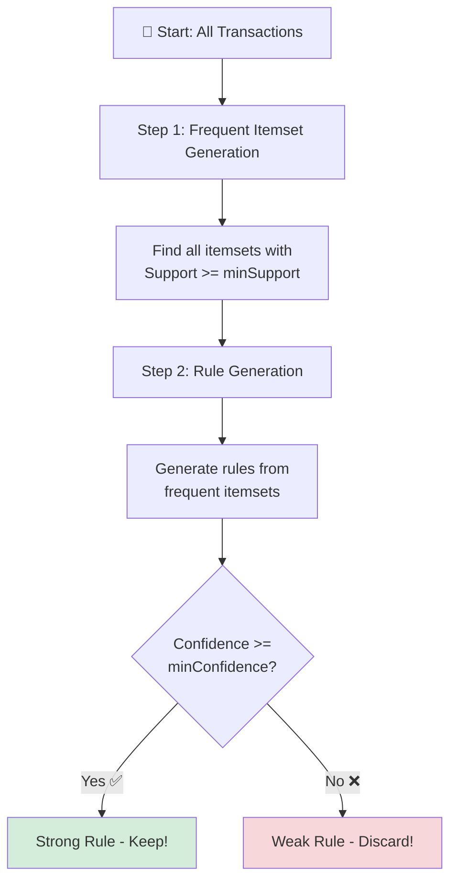
```mermaid
flowchart TD
    A[🛒 Start: All Transactions] --> B[Step 1: Frequent Itemset Generation]
    B --> C[Find all itemsets with\nSupport >= minSupport]
    C --> D[Step 2: Rule Generation]
    D --> E[Generate rules from\nfrequent itemsets]
    E --> F{Confidence >= \nminConfidence?}
    F -->|Yes ✅| G[Strong Rule - Keep!]
    F -->|No ❌| H[Weak Rule - Discard!]
    style G fill:#d4edda
    style H fill:#f8d7da
```

---

### Step 1: Frequent Itemset Generation (Iterative)

#### L1 — Frequent 1-itemsets (minSupport = 0.5):

| Itemset | Support | Frequent? |
|---------|---------|-----------|
| {Apple} | 0.833 | ✅ Yes |
| {Bread} | 0.833 | ✅ Yes |
| {Butter} | 0.500 | ✅ Yes |
| {Egg} | 0.833 | ✅ Yes |
| {Milk} | 0.833 | ✅ Yes |
| {Salt} | 0.333 | ❌ No — Pruned! |

> Salt ka support 0.5 se kam hai — toh **Salt wale saare itemsets prune** ho jayenge!

---

#### L2 — Frequent 2-itemsets:

| Itemset | Support | Frequent? |
|---------|---------|-----------|
| {Milk, Bread} | 0.667 | ✅ Yes |
| {Egg, Bread} | 0.667 | ✅ Yes |
| {Apple, Bread} | 0.667 | ✅ Yes |
| {Milk, Butter} | 0.500 | ✅ Yes |
| {Milk, Egg} | 0.667 | ✅ Yes |
| {Milk, Apple} | 0.833 | ✅ Yes |
| {Apple, Butter} | 0.500 | ✅ Yes |
| {Egg, Apple} | 0.667 | ✅ Yes |

---

### Step 2: Rule Generation Phase

Frequent itemsets se rules banao aur **Confidence check** karo:

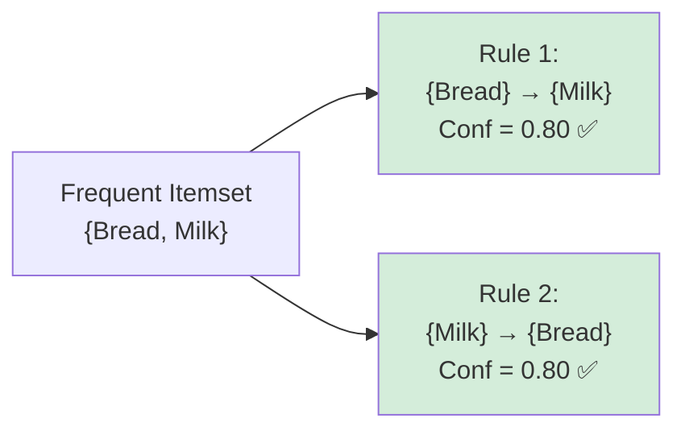
```mermaid
flowchart LR
    A["Frequent Itemset\n{Bread, Milk}"] --> B["Rule 1:\n{Bread} → {Milk}\nConf = 0.80 ✅"]
    A --> C["Rule 2:\n{Milk} → {Bread}\nConf = 0.80 ✅"]
    style B fill:#d4edda
    style C fill:#d4edda
```

---

### Time Complexity of Apriori

Without pruning (brute force):

$$\text{Time Complexity} = T \times N \times L$$

Jahan:
- $T$ = number of transactions
- $N$ = number of itemsets
- $L$ = length of longest itemset

> 💡 Pruning se ye drastically reduce hota hai — yahi Apriori ki power hai!

---

## Notes on Analysis 📝

- **Association rules are Unsupervised**: Koi prior labeling nahi chahiye
- **Low Support** → Rule shayad coincidence se aaya, reliable nahi
- **High Confidence** → Rule zyada accurate aur trustworthy hai
- **Both matter**: Sirf support ya sirf confidence pe rely mat karo — **dono threshold cross** karne chahiye
- **Apriori Pruning** → Infrequent itemset ka koi bhi superset check karne ki zaroorat nahi

---

## Strengths aur Limitations of Apriori

### Strengths ✅
- **Simple aur Easy**: Samajhna aur implement karna asaan hai
- **Pruning se Fast**: Unnecessary itemsets automatically discard hote hain
- **Interpretable**: Results easily samajh aate hain (e.g., "Bread → Milk")
- **Scalable**: Kisi bhi size ke dataset pe chalaya ja sakta hai

### Limitations ❌
- **Slow on Large Data**: Agar items zyada hain toh bohot saare candidates generate hote hain
- **Multiple Scans**: Database ko baar baar scan karna padta hai
- **Threshold Sensitive**: minSupport aur minConfidence sahi set karna tricky hai
- **Only Finds Patterns**: Causation nahi batata — sirf correlation (Bread ke saath Milk aata hai, but kyon? ye nahi batata)

---

## Quick Revision — Ek Nazar Mein 👀

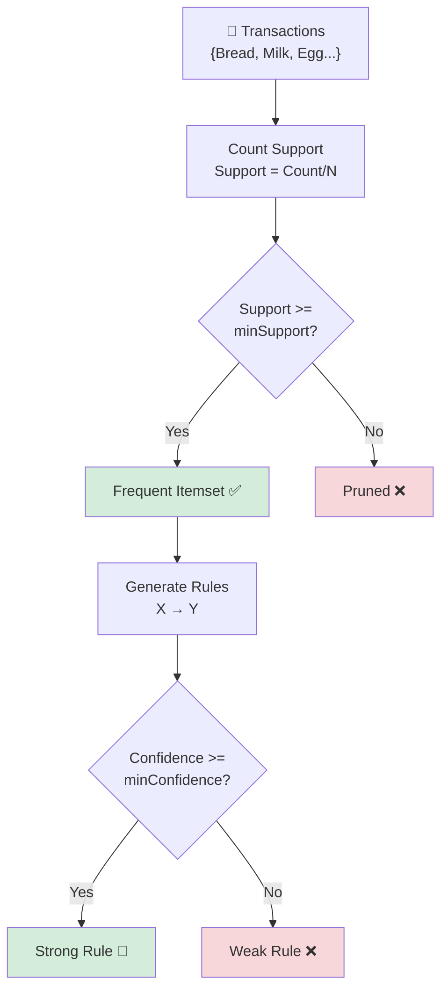
```mermaid
flowchart TD
    A["🛒 Transactions\n{Bread, Milk, Egg...}"] --> B["Count Support\nSupport = Count/N"]
    B --> C{"Support >=\nminSupport?"}
    C -->|Yes| D["Frequent Itemset ✅"]
    C -->|No| E["Pruned ❌"]
    D --> F["Generate Rules\nX → Y"]
    F --> G{"Confidence >=\nminConfidence?"}
    G -->|Yes| H["Strong Rule 💪"]
    G -->|No| I["Weak Rule ❌"]
    style D fill:#d4edda
    style H fill:#d4edda
    style E fill:#f8d7da
    style I fill:#f8d7da
```

| Concept | Formula | Simple Meaning |
|---------|---------|----------------|
| **Support** | $\frac{\sigma(X \cup Y)}{N}$ | Rule kitni baar aaya? |
| **Confidence** | $\frac{\sigma(X \cup Y)}{\sigma(X)}$ | X ke baad Y kitni baar aaya? |
| **Apriori Property** | If X infrequent → X∪anything infrequent | Chhota frequent nahi toh bada bhi nahi |
| **Strong Rule** | Support ≥ minS AND Confidence ≥ minC | Dono threshold pass! |

---
