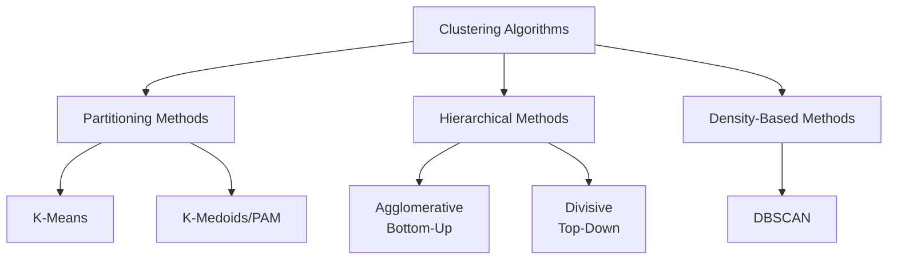

# CH-9: Unsupervised Learning

**Unsupervised Learning** is a type of machine learning used to find **hidden structures or patterns** in a given **unlabelled dataset** without any predefined labels or target outcomes.

---

## Machine Learning Classification


---

## Supervised vs Unsupervised Learning

| Aspect       | Supervised Learning            | Unsupervised Learning          |
|-------------|--------------------------------|--------------------------------|
| **Data Type**   | Labelled data                  | Unlabelled data                |
| **Objective**  | Predict outcomes               | Discover hidden structure      |
| **Output**     | Class labels / values          | Groups / association rules     |
| **Examples**   | Classification, Regression     | Clustering, Association        |

---

## Applications of Unsupervised Learning

- **Customer and Market Segmentation**: Grouping customers based on purchasing behavior and demographics for targeted marketing
- **Fraud and Anomaly Detection**: Identifying unusual patterns in transactions or system behavior that deviate from normal
- **Image Processing and Face Recognition**: Detecting and grouping similar facial features without pre-labeled training data
- **Gene Analysis and Bioinformatics**: Discovering patterns in genetic data to identify gene families or disease markers
- **Dimensionality Reduction**: Reducing the number of features while preserving important information for easier visualization
- **Document Clustering**: Organizing large collections of documents into meaningful topic-based groups
- **Artificial Intelligence Systems**: Enabling AI to learn and adapt from data without explicit programming or supervision

---

## Clustering

### Definition
Clustering is the process of grouping objects such that:
- Objects within a cluster are **highly similar** to each other
- Objects from different clusters are **highly dissimilar** from each other

### Key Characteristics

1. **Unsupervised Learning**: Works with data that has no predefined labels or categories
2. **No Predefined Class Labels**: Algorithm discovers natural groupings without prior knowledge of categories
3. **Reduces Data Complexity**: Simplifies large datasets by organizing them into meaningful groups
4. **Helps Discover Hidden Patterns**: Reveals underlying structures and relationships not immediately apparent
5. **Flexible with Different Types of Data**: Can handle numerical, categorical, text, and mixed data types
6. **Scalable to Large Datasets**: Efficient algorithms enable processing of massive amounts of data

---

### Clustering Visualization


---

### Applications of Clustering

- **Market Research**: Identifying customer segments with similar characteristics
- **Social Network Analysis**: Detecting communities and groups in social networks
- **Recommendation Systems**: Grouping users or products with similar preferences
- **Medical Diagnosis**: Identifying patient groups with similar symptoms or disease patterns
- **Astronomy**: Classifying celestial objects based on their properties
- **City Planning**: Identifying zones based on land use patterns
- **Search Engines**: Organizing search results into topic clusters

---

## Flow Diagram of Clustering Analysis


---

## K-Means Clustering: Complete Example

### Dataset
Points: `(1,2)`, `(2,1)`, `(1,1)`, `(2,2)`, `(6,7)`, `(7,6)`, `(7,8)`, `(8,7)`

---

### Step 1: Initialize Centroids

Randomly select 3 initial centroids:
- **C1** = `(1, 2)`
- **C2** = `(2, 1)`
- **C3** = `(7, 8)`

---

### Step 2: Distance Calculation (Iteration 1)

**Euclidean Distance Formula:**
```
d((x,y), (a,b)) = √[(x-a)² + (y-b)²]
```

| Point | Coordinates | d to C1(1,2) | d to C2(2,1) | d to C3(7,8) | Assigned Cluster |
|-------|-------------|--------------|--------------|--------------|------------------|
| P1    | (1, 2)      | 0.00         | 1.41         | 7.21         | C1               |
| P2    | (2, 1)      | 1.41         | 0.00         | 8.60         | C2               |
| P3    | (1, 1)      | 1.00         | 1.00         | 8.49         | C1               |
| P4    | (2, 2)      | 1.00         | 1.41         | 7.81         | C1               |
| P5    | (6, 7)      | 7.07         | 7.21         | 1.41         | C3               |
| P6    | (7, 6)      | 7.21         | 7.07         | 2.00         | C3               |
| P7    | (7, 8)      | 7.21         | 8.60         | 0.00         | C3               |
| P8    | (8, 7)      | 8.06         | 8.49         | 1.41         | C3               |

---

### Step 3: Cluster Assignment After Iteration 1

- **Cluster 1 (C1)**: `(1,2)`, `(1,1)`, `(2,2)`
- **Cluster 2 (C2)**: `(2,1)`
- **Cluster 3 (C3)**: `(6,7)`, `(7,6)`, `(7,8)`, `(8,7)`

---

### Step 4: Updated Centroids

Calculate new centroids as the mean of all points in each cluster:

**C1** = `((1+1+2)/3, (2+1+2)/3)` = `(1.33, 1.67)`

**C2** = `((2)/1, (1)/1)` = `(2.00, 1.00)`

**C3** = `((6+7+7+8)/4, (7+6+8+7)/4)` = `(7.00, 7.00)`

---

### Step 5: Distance Calculation (Iteration 2)

| Point | Coordinates | d to C1(1.33,1.67) | d to C2(2.00,1.00) | d to C3(7.00,7.00) | Assigned Cluster |
|-------|-------------|--------------------|--------------------|--------------------|--------------------|
| P1    | (1, 2)      | 0.47               | 1.41               | 7.21               | C1                 |
| P2    | (2, 1)      | 0.94               | 0.00               | 7.81               | C2                 |
| P3    | (1, 1)      | 0.75               | 1.00               | 7.21               | C1                 |
| P4    | (2, 2)      | 0.75               | 1.41               | 7.07               | C1                 |
| P5    | (6, 7)      | 6.78               | 7.21               | 1.00               | C3                 |
| P6    | (7, 6)      | 7.16               | 7.07               | 1.00               | C3                 |
| P7    | (7, 8)      | 7.93               | 8.60               | 1.00               | C3                 |
| P8    | (8, 7)      | 8.25               | 8.49               | 1.00               | C3                 |

---

### Step 6: Cluster Assignment After Iteration 2

- **Cluster 1 (C1)**: `(1,2)`, `(1,1)`, `(2,2)`
- **Cluster 2 (C2)**: `(2,1)`
- **Cluster 3 (C3)**: `(6,7)`, `(7,6)`, `(7,8)`, `(8,7)`

---

### Step 7: Convergence

**Result**: The cluster assignments remain the same as Iteration 1.

**Conclusion**: The algorithm has **converged** because:
- No points changed clusters between iterations
- Centroids remain stable
- Final clusters are well-separated


---

## Strengths and Weaknesses of K-Means

### Strengths
- **Simple and Easy to Implement**: Straightforward algorithm with minimal complexity
- **Fast and Efficient for Large Datasets**: Computationally efficient with linear time complexity
- **Scales Well with Number of Samples**: Can handle millions of data points effectively
- **Guarantees Convergence**: Algorithm always converges to a stable solution
- **Works Well with Spherical Clusters**: Performs excellently when clusters are roughly circular/spherical
- **Easy to Interpret Results**: Clear cluster assignments make results easy to understand and visualize

### Weaknesses
- **Sensitive to Outliers**: Extreme values can significantly distort cluster centroids
- **Assumes Spherical Clusters**: Struggles with non-spherical or irregular cluster shapes
- **Difficulty with Varying Cluster Sizes**: Tends to create equal-sized clusters even when natural clusters differ
- **Difficulty with Varying Densities**: Cannot handle clusters with different densities well
- **Need to Specify K in Advance**: Requires prior knowledge or estimation of number of clusters
- **May Converge to Local Optimum**: Different initializations can produce different final results

---

## Drawbacks of K-Means and Remedies

| Drawback | Remedy |
|----------|--------|
| **Sensitive to Initial Centroids** | Use **K-Means++ Initialization** for better starting centroids |
| **Requires Predefined K** | Use methods like **Elbow Method** or **Silhouette Score** to choose optimal K |
| **Sensitive to Outliers** | Use **K-Medoids (PAM)** algorithm or perform outlier detection and removal preprocessing |
| **Assumes Spherical Clusters** | Use **DBSCAN** or **Hierarchical Clustering** for arbitrary shaped clusters |
| **Handles Only Numerical Data** | Use **K-Modes** for categorical data or **K-Prototypes** for mixed data types |
| **May Converge to Local Optima** | Run algorithm **multiple times** with different random initializations and select best result |
| **Difficulty with Varying Cluster Sizes** | Use **Expectation-Maximization (EM)** algorithm or density-based methods |
| **Poor Performance with High Dimensions** | Apply **dimensionality reduction** techniques (PCA, t-SNE) before clustering |

---

---

## Within Cluster Homogeneity and Heterogeneity

### Concepts
- **Within Cluster Homogeneity**: Similarity within the cluster (how alike data points are within the same cluster)
- **Within Cluster Heterogeneity**: Dissimilarity between data points within the cluster (how different data points are within the same cluster)

### Goal of Clustering
- **Reduce Heterogeneity** → Data points within a cluster should be as different as possible from each other is NOT the goal
- **Increase Homogeneity** → Data points within a cluster should be as similar as possible to each other

---

## Choosing Appropriate Number of Clusters (K)

There is **no fixed formula** to determine the number of clusters (K).

### Rule of Thumb (Small Datasets)
For small datasets, a commonly followed rule is:

$$K = \sqrt{\frac{n}{2}}$$

where $n$ = number of data points

### For Large Datasets
Several **statistical methods** are used to determine suitable number of clusters:
- Elbow Method
- Silhouette Score
- Gap Statistic
- Davies-Bouldin Index

---

## Elbow Method

The **Elbow Method** determines the optimal number of clusters (K) by analyzing the trade-off between model complexity and performance.

### Concept
- **Less K** → **Underfitting** (too few clusters, high error)
- **More K** → **Overfitting** (too many clusters, diminishing returns)

### How It Works
Measures the **homogeneity/heterogeneity** within clusters for different K values.

**As K Increases:**
- Homogeneity **increases** (points are closer to their centroids)
- Heterogeneity **decreases** (clusters are tighter)
- Beyond a certain K, further increase gives **diminishing returns**

### Finding the Optimal K
The **elbow point** is where the rate of decrease in error sharply slows down, indicating the optimal K.

### Visualization


*The graph shows SSE (Sum of Squared Errors) vs K. The "elbow" at K=3 indicates the optimal number of clusters.*

---

## Choosing Initial Centroids

Proper selection of **initial centroids** is crucial for K-Means clustering effectiveness.

### Problems with Random Selection
- May lead to higher **SSE (Sum of Squared Errors)**
- Results in **sub-optimal clusters**
- Repeated runs may not always find optimal clusters due to data spread

### Better Approaches

#### 1. Hierarchical Clustering Initialization
- Apply **hierarchical clustering** on a sample to get K clusters
- Use the **centroids of these clusters** as initial centroids
- Useful for small datasets or when K is small compared to the data points

#### 2. Advanced Methods
- **K-Means++**: Smart initialization algorithm that spreads out initial centroids
- **Bisecting K-Means**: Hierarchical approach to K-Means
- **Post-processing Refinements**: Improve centroid selection and reduce SSE

---

## Iterative Steps and SSE (Sum of Squared Errors)

### Iterative Process
K-Means **iteratively recomputes centroids** to minimize distances within clusters.

### Distance Measurement
**Euclidean Distance** is used to measure the proximity of data points to centroids:

$$\text{dist}(x, c) = \sqrt{\sum_{i=1}^{n}(x_i - c_i)^2}$$

where:
- $x$ = data point
- $c$ = centroid
- $n$ = number of features

### Quality Measurement: SSE
The quality of clustering is measured using **SSE (Sum of Squared Errors)**:

$$\text{SSE} = \sum_{k=1}^{K} \sum_{x \in C_k} \text{dist}(x, c_k)^2$$

where:
- $K$ = number of clusters
- $C_k$ = cluster $k$
- $c_k$ = centroid of cluster $k$
- $x$ = data point in cluster $C_k$

### Key Points
- **Lower SSE** indicates better centroid positioning
- Centroid minimizing SSE is the **mean** of cluster points
- **Limitation**: SSE is **sensitive to outliers**

### Factors Affecting K-Means Outcome
1. **Initial random selection of centroids**
2. **Number of clusters (K)**

### Improving Reliability
- Run K-Means **multiple times** with different initial centroids
- **Vary K** and use elbow method or other metrics
- Clustering is often used **before classification** to identify subgroups in unlabeled data

---

## Complexity of K-Means Algorithm

### Time Complexity

$$O(nKt)$$

where:
- $n$ = total number of data points/objects in dataset
- $K$ = number of clusters
- $t$ = number of iterations

### Scalability
- Normally, $K$ and $t$ are **much smaller than** $n$
- Therefore, K-Means is **scalable and efficient** for processing large datasets

---

## Observations on K-Means

1. **Voronoi Boundaries**: Help visualize the cluster regions and decision boundaries between clusters
2. **Initial Centroid Dependency**: Final clusters depend heavily on initial centroid selection
3. **Multiple Runs**: Running with different centroids can improve global clustering results
4. **Practical Application**: Example - Software Defect Clustering for bug classification

### Visualization of Voronoi Boundaries


*The diagram shows four clusters (C1, C2, C3, C4) with Voronoi boundaries separating them. Each region represents all points closest to that cluster's centroid.*

---

## Problem with K-Means: Sensitivity to Outliers

### Example: Why K-Medoid is Better Than K-Means

**Dataset (1D):** `[1, 2, 3, 5, 9, 10, 11, 25]`

- **Point 25 is an outlier** and affects cluster formation negatively when **mean** is considered as centroids
- Let's take **K = 2** and form clusters

---

### K-Means Approach (Using Mean)

#### Initial Random Clusters
- **Cluster 1**: `{1, 2, 3, 5}`
- **Cluster 2**: `{9, 10, 11, 25}`

#### Calculate Centroids (Mean)

**Centroid of Cluster 1:**
$$c_1 = \frac{1 + 2 + 3 + 5}{4} = \frac{11}{4} = 2.75$$

**Centroid of Cluster 2:**
$$c_2 = \frac{9 + 10 + 11 + 25}{4} = \frac{55}{4} = 13.75$$

#### Problem
- The outlier **25** pulls the centroid of Cluster 2 to **13.75**
- This centroid is **far from most points** in the cluster (9, 10, 11)
- Points 9, 10, 11 are now relatively far from their own centroid due to the outlier
- This leads to **higher SSE** and **poor cluster quality**

---

### K-Medoids Approach (Using Medoid)

**Medoid** = An **actual data point** from the cluster that minimizes the sum of distances to all other points in the cluster

#### Initial Random Clusters
- **Cluster 1**: `{1, 2, 3, 5}`
- **Cluster 2**: `{9, 10, 11, 25}`

#### Calculate Medoids

**Medoid of Cluster 1:**

Test each point as potential medoid:
- If medoid = 1: SSE = |1-1| + |2-1| + |3-1| + |5-1| = 0 + 1 + 2 + 4 = **7**
- If medoid = 2: SSE = |1-2| + |2-2| + |3-2| + |5-2| = 1 + 0 + 1 + 3 = **5**
- If medoid = 3: SSE = |1-3| + |2-3| + |3-3| + |5-3| = 2 + 1 + 0 + 2 = **5**
- If medoid = 5: SSE = |1-5| + |2-5| + |3-5| + |5-5| = 4 + 3 + 2 + 0 = **9**

**Medoid of Cluster 1 = 2 or 3** (let's choose **2**)

**Medoid of Cluster 2:**

Test each point as potential medoid:
- If medoid = 9: SSE = |9-9| + |10-9| + |11-9| + |25-9| = 0 + 1 + 2 + 16 = **19**
- If medoid = 10: SSE = |9-10| + |10-10| + |11-10| + |25-10| = 1 + 0 + 1 + 15 = **17**
- If medoid = 11: SSE = |9-11| + |10-11| + |11-11| + |25-11| = 2 + 1 + 0 + 14 = **17**
- If medoid = 25: SSE = |9-25| + |10-25| + |11-25| + |25-25| = 16 + 15 + 14 + 0 = **45**

**Medoid of Cluster 2 = 10** (actual data point, not affected as much by outlier)

#### Advantage
- Medoid **10** is an actual data point
- It's **closer to most cluster members** (9, 10, 11)
- The outlier **25** has **less influence** because we choose an actual representative point
- Results in **lower SSE** and **better cluster quality**

---

## K-Medoids: A Representative Object-Based Technique

### Definition
- Uses **actual data points** as cluster representatives (**medoids**)
- Assigns points to the nearest medoid instead of centroid
- **Medoid** = A member of the cluster that minimizes total distance to all other members

### SSE Formula for K-Medoids

$$\text{SSE} = \sum_{i=1}^{K} \sum_{x \in C_i} \text{dist}(o_i, x)^2$$

where:
- $o_i$ = medoid of cluster $C_i$
- $x$ = data point in cluster $C_i$
- $K$ = number of clusters

---

## Partitioning Around Medoids (PAM) Algorithm

### Algorithm Steps

1. **Initialize**: Randomly select $K$ points as initial medoids  
2. **Assignment**: Assign each remaining point to the cluster of the nearest medoid  
3. **Swap and Test**: For each cluster:  
   - Randomly select a non-medoid point $o'$  
   - **Swap** $o'$ with current medoid $o_i$ and compute new SSE  
   - **If** $SSE_{new} < SSE_{old}$:  
     - Keep the swap  
     - Reassign points to nearest medoid  
4. **Repeat** until no improvement in SSE


### Pseudocode

```
PAM Algorithm:
1. SELECT K random points as initial medoids
2. REPEAT:
     FOR each medoid o_i:
         FOR each non-medoid point o':
             SWAP o_i with o'
             COMPUTE SSE_new
             IF SSE_new < SSE_old:
                 KEEP the swap
                 UPDATE medoid to o'
                 REASSIGN all points to nearest medoid
3. UNTIL no change in medoids
```

### Time Complexity

$$O(K(n-K)^2)$$

where:
- $K$ = number of medoid points
- $n-K$ = number of non-medoid points

### Advantages
- **Robust to outliers and noise** (main advantage over K-Means)
- Works with any distance metric
- Medoids are actual data points, making them interpretable

### Limitations
- **Not scalable** to very large datasets
- Requires **sample-based approaches** for large datasets
- Higher computational cost than K-Means

---

## K-Means vs K-Medoids: Comparison

| Aspect | K-Means | K-Medoids (PAM) |
|--------|---------|-----------------|
| **Cluster Representative** | Centroid (mean of points) | Medoid (actual data point) |
| **Calculation** | Mean of all points in cluster | Actual point minimizing total distance |
| **Outlier Sensitivity** | Highly sensitive to outliers | Robust to outliers |
| **Cluster Shape** | Works best with spherical clusters | Can handle various shapes better |
| **Time Complexity** | $O(nKt)$ - faster | $O(K(n-K)^2)$ - slower |
| **Scalability** | Excellent for large datasets |  Limited for large datasets |
| **Distance Metric** | Primarily Euclidean | Works with any distance metric |
| **Interpretability** | Centroids may not be real points | Medoids are actual data points |
| **Noise Handling** | Poor performance with noisy data | Better performance with noisy data |
| **Convergence** | Always converges | Always converges |
| **Use Case** | Large, clean datasets with spherical clusters | Small to medium datasets with outliers/noise |
| **Memory Usage** | Lower | Higher |
| **Implementation** | Simpler | More complex |

---

---

## Types of Clustering Algorithms

Clustering algorithms can be broadly categorized into **three main types**:



---

## Hierarchical Clustering

### Definition
Hierarchical clustering is used to group data into a **tree-like structure (hierarchy)** rather than creating fixed, flat clusters. It is particularly useful when data has **nested groups** or natural hierarchical relationships.

### Applications
- **Organizational Structures**: Organizing employees into departments, teams, and roles
- **Taxonomy Creation**: Building biological classification systems (Kingdom → Phylum → Class → Species)

---

## Types of Hierarchical Clustering

### 1. Agglomerative (Bottom-Up Approach)

**Process:**
- Each object starts as its **own individual cluster**
- Clusters are **merged iteratively** based on similarity
- Continues until all objects are in one cluster or desired number of clusters is reached

**Steps:**
1. Start: Each data point is a separate cluster
2. Merge: Find the two closest clusters and combine them
3. Repeat: Continue merging until termination condition is met

**Example:**
```
Level 0: {A} {B} {C} {D} {E}     (5 clusters)
Level 1: {AB} {C} {D} {E}        (4 clusters - A and B merged)
Level 2: {AB} {CD} {E}           (3 clusters - C and D merged)
Level 3: {AB} {CDE}              (2 clusters - CD and E merged)
Level 4: {ABCDE}                 (1 cluster - all merged)
```

---

### 2. Divisive (Top-Down Approach)

**Process:**
- Start with **one cluster** containing all objects
- Iteratively **split clusters** into smaller sub-clusters
- Continues until each object is in its own cluster or desired number is reached

**Steps:**
1. Start: All data points in one cluster
2. Split: Divide the cluster into two sub-clusters
3. Repeat: Continue splitting until termination condition is met

**Example:**
```
Level 0: {ABCDE}                 (1 cluster)
Level 1: {AB} {CDE}              (2 clusters - split into two)
Level 2: {AB} {CD} {E}           (3 clusters - CDE split)
Level 3: {A} {B} {CD} {E}        (4 clusters - AB split)
Level 4: {A} {B} {C} {D} {E}     (5 clusters - all separated)
```

---

## Dendrogram Representation

A **dendrogram** is a tree-like diagram that shows the step-by-step creation of hierarchical clustering. It visualizes:
- How clusters are merged (agglomerative) or split (divisive)
- The distance/similarity at which merges/splits occur
- The hierarchical relationship between clusters

### Dendrogram Structure


*The dendrogram shows agglomerative clustering from bottom (individual points A, B, C, D, E) to top (all merged). The height of each merge indicates the distance between clusters.*

### Key Features:
- **Y-axis (Height)**: Represents distance or dissimilarity between clusters
- **X-axis**: Individual data points
- **Horizontal Lines**: Indicate cluster mergers
- **Vertical Lines**: Connect clusters being merged

### Cutting the Dendrogram:
You can "cut" the dendrogram at any height to get a specific number of clusters:
- Cut at **Level 2**: Get 3 clusters {AB}, {CD}, {E}
- Cut at **Level 3**: Get 2 clusters {AB}, {CDE}

---

## Distance Measures Between Clusters

Let $C_i$ and $C_j$ be two clusters with:
- $n_i$ and $n_j$ = number of points in each cluster
- $m_i$ and $m_j$ = means (centroids) of the clusters
- $p \in C_i$ = points belonging to cluster $C_i$

### 1. Single Linkage (Minimum Distance)

$$D_{\text{min}}(C_i, C_j) = \min_{p \in C_i, q \in C_j} d(p, q)$$

- **Definition**: Minimum distance between any two points from different clusters
- **Characteristic**: Uses the **closest pair** of points

---

### 2. Complete Linkage (Maximum Distance)

$$D_{\text{max}}(C_i, C_j) = \max_{p \in C_i, q \in C_j} d(p, q)$$

- **Definition**: Maximum distance between any two points from different clusters
- **Characteristic**: Uses the **farthest pair** of points

---

### 3. Average Linkage (Mean Distance)

$$D_{\text{avg}}(C_i, C_j) = \frac{1}{n_i \times n_j} \sum_{p \in C_i} \sum_{q \in C_j} d(p, q)$$

- **Definition**: Average distance between all pairs of points from different clusters
- **Characteristic**: Considers **all pairwise distances**

---

### 4. Centroid Distance

$$D_{\text{centroid}}(C_i, C_j) = d(m_i, m_j)$$

- **Definition**: Distance between the centroids (means) of two clusters
- **Characteristic**: Uses **cluster centers**

---

## Distance Visualization


*The diagram illustrates five different distance/linkage methods for measuring similarity between clusters:*

1. **Single Linkage**: Minimum distance between the closest elements in the two clusters
2. **Complete Linkage**: Maximum distance between the farthest elements in the two clusters  
3. **Average Linkage**: Average of all pairwise distances between elements in the clusters
4. **Centroid Method**: Distance between the centroids (mean points) of the two clusters
5. **Ward's Method**: Merges clusters to minimize the increase in total within-cluster variance

*Each method uses a different strategy to determine which clusters should be merged during hierarchical clustering.*

---

## Key Points of Hierarchical Clustering

### Important Characteristics:
1. **Bottom-Up vs Top-Down**: 
   - Agglomerative starts with individual points and merges
   - Divisive starts with all points together and splits

2. **No Swaps Allowed**: 
   - Once clusters are merged (agglomerative) or split (divisive), the decision is **permanent**
   - Cannot undo or reassign points later

3. **Termination Conditions**:
   - Based on **threshold distance** (stop when cluster distance exceeds threshold)
   - Based on **number of clusters** (stop when desired K is reached)
   - When all points are in one cluster (agglomerative)
   - When all points are separate (divisive)

4. **Dendrogram Visualization**: 
   - Provides a complete picture of the hierarchical structure
   - Shows all merging/splitting steps and distances

5. **No Need to Specify K in Advance**: 
   - Unlike K-Means, you can decide the number of clusters **after** seeing the dendrogram

---

## Distance-Based Linkage Methods

### 1. Nearest Neighbor / Single Linkage

**Method**: Merge clusters based on $D_{\text{min}}$ (minimum distance)

**Characteristics:**
- Uses the **closest pair** of points between clusters
- ⚠️ **Sensitive to chaining**: Can create long, chain-like clusters
- ⚠️ **Sensitive to outliers**: A single outlier can bridge two distinct clusters

### Example:
```
Initial Objects:

A       B       C       D       E

Distance Values:

<-------------------- Dmin = 3 ----------------->

AB  <--- Dmin = 2 --->  CD  <--- Dmin = 1 --->  E


Explanation:

- Dmin (CD, E) = 1   ← Minimum distance
- Dmin (AB, CD) = 2
- Dmin (AB, E) = 3

Since Dmin = 1 is the smallest,

👉 Clusters CD and E will merge first.

After First Merge (Next Level):

AB      CDE
```

---

### 2. Furthest Neighbor / Complete Linkage

**Method**: Merge clusters based on $D_{\text{max}}$ (maximum distance)

**Characteristics:**
- Uses the **farthest pair** of points between clusters
- ✅ Creates **compact, tight clusters**
- ⚠️ **Sensitive to outliers**: Outliers can prevent natural clusters from merging
- Better at avoiding chaining effect

**Example:**

```
Dataset: A, B, C, D, E

Uses maximum distance between any two points in different clusters

Tends to create more balanced, spherical clusters
Avoids elongated clusters
```

---

### 3. Mean / Average Linkage

**Method**: Merge clusters based on **average of** $D_{\text{min}}$ **and** $D_{\text{max}}$

**Characteristics:**
- Provides a **balanced approach** between single and complete linkage
- ✅ **More stable** and less sensitive to outliers
- ✅ Works well in most practical scenarios
- Considers all pairwise distances, not just extremes

**Why it's better:**
- Single linkage (Dmin) can cause chaining
- Complete linkage (Dmax) can be too strict
- Average linkage provides a **middle ground**

---

## Comparison of Linkage Methods

| Linkage Type | Distance Used | Advantages | Disadvantages | Best For |
|--------------|--------------|------------|---------------|----------|
| **Single (Minimum)** | $D_{\text{min}}$ | Simple; Can find non-spherical clusters | Chaining effect; Sensitive to noise/outliers | Non-spherical, well-separated clusters |
| **Complete (Maximum)** | $D_{\text{max}}$ | Compact clusters; Avoids chaining | Sensitive to outliers; May break natural clusters | Spherical, compact clusters |
| **Average (Mean)** | $D_{\text{avg}}$ | Balanced; Less sensitive to outliers | Moderate computational cost | General-purpose clustering |
| **Centroid** | $D_{\text{centroid}}$ | Intuitive; Fast computation | Can produce inversions in dendrogram | Large datasets with clear centroids |

---

## Density-Based Methods: DBSCAN

### Motivation

When using **partitioning** (K-Means) and **hierarchical clustering** methods, the resulting clusters are usually **spherical** (circular/ball-shaped).

**Problem:** These methods **fail to capture arbitrarily shaped clusters**, such as:
- S-shaped clusters
- Crescent-shaped clusters
- Clusters with irregular boundaries
- Clusters of varying densities

### Solution: Density-Based Clustering

The **density-based clustering approach** addresses this issue by:
- Identifying **dense regions** (areas with many points close together)
- Identifying **sparse regions** (areas with few scattered points)
- Forming clusters by connecting high-density regions
- Treating low-density regions as **noise** or **outliers**

---

## DBSCAN Algorithm

**DBSCAN** = **D**ensity-**B**ased **S**patial **C**lustering of **A**pplications with **N**oise

### Definition
DBSCAN is a popular density-based algorithm that forms clusters by connecting regions with **high point density** and labels isolated points in low-density regions as **noise/outliers**.

---

### Key Concepts

#### 1. **Eps (ε) - Epsilon**
- Radius of the neighborhood around a point
- Defines how close points need to be to be considered "neighbors"

#### 2. **MinPts - Minimum Points**
- Minimum number of points required to form a dense region
- If a neighborhood has ≥ MinPts, it's considered dense

#### 3. **Point Types**

**Core Point:**
- A point with **at least MinPts** points within its Eps radius (including itself)
- Forms the "center" of a cluster

**Border Point:**
- A point within the Eps radius of a core point
- Has **fewer than MinPts** in its own neighborhood
- Part of a cluster but not at its core

**Noise Point (Outlier):**
- Not a core point
- Not within Eps radius of any core point
- Does not belong to any cluster

---

### DBSCAN Algorithm Steps

```
DBSCAN(D, Eps, MinPts):
1. Mark all points as unvisited
2. FOR each unvisited point p in dataset D:
     a. Mark p as visited
     b. Find all neighbors of p within Eps radius
     c. IF neighbors < MinPts:
           Mark p as NOISE
        ELSE:
           Create new cluster C
           Add p to cluster C (p is a core point)
           FOR each neighbor point q:
               IF q is unvisited:
                  Mark q as visited
                  Find neighbors of q within Eps
                  IF neighbors of q >= MinPts:
                     Add q's neighbors to expansion list
               IF q is not in any cluster:
                  Add q to cluster C
3. Return all clusters
```

---

### DBSCAN Example

**Parameters:**
- Eps = 1.5
- MinPts = 3

**Dataset Visualization:**

```
Given points in 2D space:
Dense region 1: Points close together (will form Cluster 1)
Dense region 2: Points close together (will form Cluster 2)
Isolated points: Far from any dense region (marked as noise)
```

**Process:**
1. **Identify Core Points**: Points with ≥ 3 neighbors within radius 1.5
2. **Expand Clusters**: Connect core points and their neighbors
3. **Mark Border Points**: Points within radius of core points but not core themselves
4. **Identify Noise**: Remaining isolated points

---

### DBSCAN Visualization


---

## Advantages and Disadvantages of DBSCAN

### Advantages ✅
- **Discovers arbitrary-shaped clusters**: Can find non-spherical, complex cluster shapes
- **No need to specify K**: Unlike K-Means, doesn't require number of clusters in advance
- **Robust to outliers**: Automatically identifies and ignores noise points
- **Handles varying densities**: Can find clusters of different shapes and sizes
- **Single scan of database**: Efficient for large datasets

### Disadvantages ❌
- **Sensitive to parameters**: Choosing Eps and MinPts can be challenging
- **Difficulty with varying densities**: Struggles when clusters have very different densities
- **High-dimensional data**: Performance degrades in high-dimensional spaces (curse of dimensionality)
- **Border point ambiguity**: Border points can be assigned to different clusters depending on processing order
- **Memory intensive**: Needs to store distance matrix for large datasets

---

## Comparison: Partitioning vs Hierarchical vs Density-Based

| Aspect | Partitioning<br/>(K-Means, K-Medoids) | Hierarchical<br/>(Agglomerative, Divisive) | Density-Based<br/>(DBSCAN) |
|--------|--------------------------------------|-------------------------------------------|---------------------------|
| **Cluster Shape** | Spherical only | Spherical preferred | Arbitrary shapes ✅ |
| **Number of Clusters** | Must specify K | Can choose after viewing dendrogram | Automatic discovery ✅ |
| **Outlier Handling** | Assigns all points to clusters | Assigns all points to clusters | Identifies outliers ✅ |
| **Computational Cost** | Low: O(nKt) | High: O(n²log n) | Moderate: O(n log n) |
| **Result Visualization** | Scatter plot | Dendrogram tree | Scatter plot with noise |
| **Deterministic** | No (random initialization) | Yes | Yes (with fixed order) |
| **Scalability** | Excellent ✅ | Poor for large data | Good |
| **Best Use Case** | Large, spherical clusters | Hierarchical relationships | Arbitrary shapes, noise detection |

---

## When to Use Which Clustering Method?

### Use **K-Means** when:
- ✅ Clusters are roughly spherical
- ✅ Number of clusters is known
- ✅ Working with very large datasets
- ✅ Speed is critical

### Use **K-Medoids** when:
- ✅ Data contains outliers
- ✅ Need actual data points as representatives
- ✅ Using non-Euclidean distance metrics
- ✅ Dataset is small to medium-sized

### Use **Hierarchical Clustering** when:
- ✅ Need to understand data hierarchy
- ✅ Don't know the number of clusters in advance
- ✅ Want to visualize cluster relationships
- ✅ Dataset is small (due to computational cost)

### Use **DBSCAN** when:
- ✅ Clusters have arbitrary shapes
- ✅ Data contains noise and outliers
- ✅ Don't know the number of clusters
- ✅ Clusters have similar density

---

